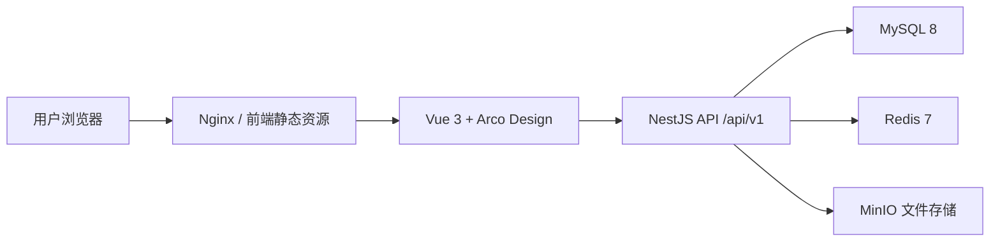

# 技术架构说明

## 架构概览

## 前端

- 框架：Vue 3、TypeScript、Vite。
- UI：Arco Design Vue。
- 状态：Pinia。
- 路由：Vue Router。
- 国际化：vue-i18n。
- 请求：Axios 封装在 `src/api/request.ts`，统一处理 token、错误提示和响应数据。

## 后端

- 框架：NestJS 11。
- ORM：Prisma 5。
- 数据库：MySQL 8。
- 缓存：Redis 7。
- 文件：MinIO。
- 文档：Swagger `/api/docs`。
- API 前缀：`/api/v1`。

## 本地模拟

`scripts/local-test-server.mjs` 负责在无完整后端环境时提供前端静态资源和模拟 API，覆盖登录、用户信息、菜单、知识库、文件预览和常用配置接口。

## 部署

- 开发测试：本地 pnpm + 模拟服务。
- Docker 本地：`docker-compose.yml` + `.env.example`。
- 生产服务器：GitHub 推送后，服务器执行 `deploy-git.sh` 拉取代码、备份数据、构建镜像、启动服务。
