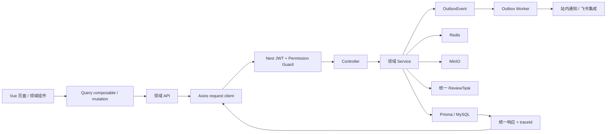
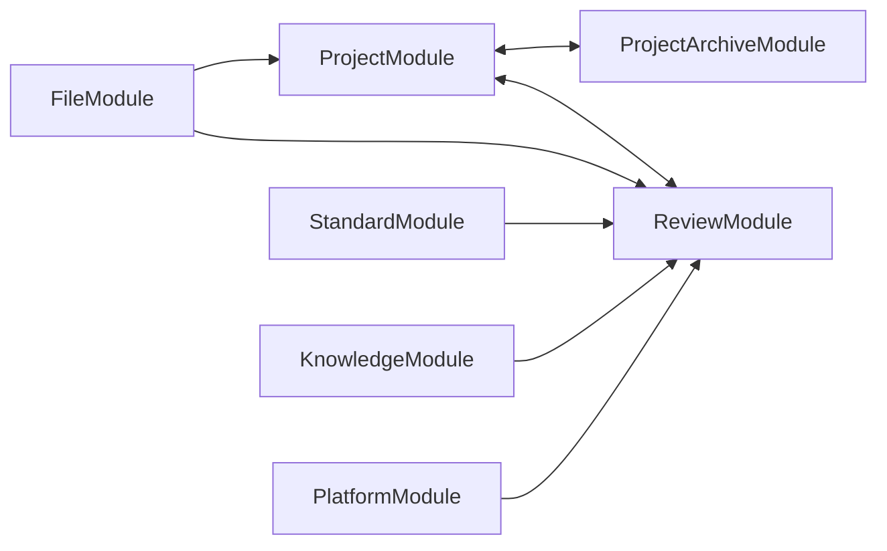

# 交付管理平台当前架构审计与重构准备

> 历史审计快照：本文记录 2026-07-25 重构前基线，文件数、路由、页面和“当前”措辞不代表 2026-07-27 目标架构。现行事实以 [平台目标架构](platform-architecture.md)、[Figma 页面清单](figma-page-inventory.md) 和源码为准。

## 1. 审计范围与结论

审计日期：2026-07-25。

本次审计覆盖前端源码、后端源码、Prisma、依赖清单、构建配置、测试、脚本和现有文档。扫描和验证均限制在项目根目录内，未读取或修改 `.env`、`.env.local` 等实际敏感环境文件；构建和测试也显式禁止自动加载环境文件。`node_modules`、`dist`、`coverage`、`.git` 不作为源码审计对象；`.ai-work` 只核对用途和数量，不读取其中的验收内容，也不做删除。

审计基线如下：

| 范围 | 基线规模 |
| --- | ---: |
| 前端 `src/` | 203 个文件，54 个 Vue 单文件组件 |
| 前端测试 | 42 个 Vitest、1 个真实 API Playwright、4 个 UI Playwright |
| 后端 `src/` | 237 个 TypeScript 文件，其中生产文件 166 个、单元测试 71 个 |
| 后端模块 | 25 个一级模块目录、26 个 Module 文件、37 个 Service、38 个 DTO 文件 |
| 后端 HTTP API | 27 个 Controller 文件，共 165 个路由 |
| Prisma | 83 个 Model、9 个 Enum、34 个 Migration |
| 后端真实 API E2E | 1 个 |

总体判断：

1. 项目已经具备统一响应、权限码、数据范围、统一文件、统一审核、Outbox、Pinia 与 TanStack Query 等平台基础，当前不是“无架构”状态。
2. 前端采用横向分层，领域页面、API、类型、Query 和测试分散；后端按模块组织，但项目、档案、审核之间存在双向依赖。
3. 最大维护风险来自巨型页面、巨型 Service、平台能力边界不显式、审计与权限目录漂移，以及 Prisma 目标模型和历史模型长期共存。
4. 本阶段只完成零引用内容和目录残留的最小清理，没有迁移目录、改变业务逻辑、修改权限或调整数据库结构。

## 2. 当前架构总结

### 2.1 前端架构

前端启动链路为：

```text
main.ts
  -> Vue / Pinia / TanStack Query / Arco / Router / i18n
  -> App.vue
  -> BasicLayout + shellRoutes
  -> views/<area>
  -> composables/queries 或领域 API
  -> api/request.ts
  -> NestJS API
```

当前主要结构：

- `main.ts` 负责所有 Provider 装配，并初始化主题和历史认证存储清理。
- `router/index.ts` 同时维护路由、菜单元数据、页面标题和导航分组，是当前导航单一事实源。
- `layouts/` 提供 Header、Sidebar、Breadcrumb 和基础工作台壳。
- `store/` 中的 Pinia 只保存用户会话、权限、主题、侧栏和语言，业务服务端状态没有进入 Pinia。
- `query/` 提供统一 QueryClient 和 Query Key；`composables/queries/` 负责主要读取查询。
- 页面写操作通常直接调用领域 API，再由页面手工失效 Query。
- `api/request.ts` 统一 Axios、访问令牌、刷新会话、响应解包和错误提示。
- `App.vue` 全局挂载附件预览弹窗，`FilePreviewRouter` 根据服务端预览会话选择 PDF、图片、DeepZoom、OnlyOffice、Markdown、XMind 或媒体查看器。

现有前端架构的积极基础是：路由和菜单同源、服务端状态与客户端状态已分离、业务请求统一进入 `src/api/`、Arco 是唯一 UI 组件体系。

### 2.2 后端架构

后端请求链路为：

```text
HTTP
  -> request trace middleware
  -> Helmet / CORS
  -> Nest ValidationPipe
  -> 自定义 ValidationPipe
  -> SanitizePipe
  -> JWT Guard / Permissions Guard
  -> Controller
  -> Domain Service
  -> Prisma / Redis / MinIO
  -> OperationAuditInterceptor
  -> TransformInterceptor 或 HttpExceptionFilter
```

主要结构：

- `app.module.ts` 注册基础设施和当前运行时业务模块。
- `common/` 提供装饰器、Guard、Pipe、Interceptor、异常过滤和 trace。
- `database/` 封装 Prisma 和 Redis。
- `modules/` 按当前业务能力组织 Controller、Service、DTO 和测试。
- `prisma/` 同时承载 Schema、Migration、Seed、三个数据迁移/核验链路及知识库种子文件。
- `workers/` 包含文件处理 Worker 和 Outbox Worker，生产上是独立运行单元。

普通成功和异常响应均使用：

```text
{ code, message, data, timestamp, traceId }
```

文件下载和缩略图通过 `@RawResponse()` 返回二进制，是明确例外。

### 2.3 数据流与平台链路



关键业务数据流：

- 项目创建：项目幂等键校验、金额快照、成员与回款、档案模板快照、可选创建审核、审计和 Outbox 在服务层编排。
- 文件上传：Multer 接收文件，`UnifiedFileService` 写入 MinIO，并在事务中写 `LogicalFile/FileAsset/FileVersion`、处理任务、审核任务、审计和 Outbox。
- 文件处理：Worker 通过租约、重试和死信状态生成缩略图、预览或转换产物。
- 审核：标准、知识、档案模板、项目创建和项目档案共用 `ReviewTask/Step/Assignee/ActionEvent`。
- 通知：业务事务写 Outbox；Worker 再调用 Notification 与 Integration，避免业务事务直接依赖外部网络。

## 3. 当前目录结构分析

### 3.1 前端目录

| 目录 | 当前职责 | 主要问题与维护风险 |
| --- | --- | --- |
| `src/api/` | 统一请求基础、26 个领域/平台 API 文件、12 个 API 测试 | 请求基础设施和所有领域接口扁平混放；跨域文件、角色、刷新接口有重复实现 |
| `src/views/` | 路由页面、部分领域组件、表单配置和 presenter | 页面与领域内部组件混放；多个页面超过 1,000 行 |
| `src/components/` | 通用视觉组件、权限组件、文件预览 | `business/` 同时承载设计系统、权限和业务状态；平台文件能力没有独立边界 |
| `src/composables/` | 权限、认证、文件预览和 6 个查询聚合文件 | Administration、Content、Operations 等横向聚合跨多个领域 |
| `src/query/` | QueryClient 和全局 Query Key | 16 组领域 key 集中在单文件，领域迁移会同时修改全局目录 |
| `src/store/` | user、permission、app、locale | 边界总体合理，但 `userStore` 同时依赖 API、Router、QueryClient 和文件预览 |
| `src/types/` | 19 个全局类型文件 | 领域类型扁平；部分 DTO 又定义在 API 文件中 |
| `src/utils/` | 格式化、认证、Blob、Markdown、项目字典等 | 通用工具和项目领域工具混放 |
| `src/router/` | 路由、菜单、标题、访问回退、URL 状态 | 与 Layout、User Store、Request 形成静态依赖循环 |
| `src/styles/` | 全局样式和 SCSS token | token 数量有限，大型页面仍大量硬编码颜色和局部样式 |
| `src/layouts/` | 工作台 Shell | 职责清楚，但依赖 Router，参与应用层循环 |
| `src/locales/` | 中英文资源 | 仍有 18 个生产文件包含硬编码中文 |

扫描时 `src/stores/` 只包含一份实际测试 `store/user.ts` 的测试文件，已在本阶段归位到 `src/store/__tests__/`，并删除空的复数目录。

前端存在两个明确静态循环：

```text
router/index.ts -> BasicLayout.vue -> store/user.ts -> router/index.ts
store/user.ts -> api/auth.ts -> api/request.ts -> router/index.ts
```

这使 Router、认证状态和 HTTP 客户端难以独立测试，也会增加初始化顺序风险。

### 3.2 后端目录

| 目录 | 当前职责 | 主要问题与维护风险 |
| --- | --- | --- |
| `src/common/` | 通用协议层和横切能力 | `operation-audit.interceptor.ts` 直接依赖业务 OperationLogService 和 JwtPayload，公共层反向依赖业务模块 |
| `src/config/` | 应用、认证、数据库、存储、文档、文件处理、Redis 配置 | 运行时集中，但验证构建必须避免实例化应用配置 |
| `src/database/` | Prisma、Redis 和数据库契约测试 | 基础设施边界清楚 |
| `src/modules/` | 25 个一级模块目录 | `platform` 是字典、部门、引用、审批配置的聚合桶；Project/Archive/Review 存在循环 |
| `src/workers/` | 文件处理和 Outbox 调度入口 | 属于平台运行单元，应继续与 HTTP 进程分离 |
| `prisma/` | 目标/历史 Schema、迁移、Seed、Migrator、Verify、二进制种子 | 83 个模型和大型迁移程序集中，历史模型不能按静态零调用直接删除 |
| `test/` | 真实 API E2E | 仅覆盖健康、认证和项目基础链路，文件、审核、标准、知识、通知覆盖不足 |

明确循环：



循环的主要诱因：

- `ProjectAccessService` 是 `DataScopeService` 的兼容 facade，却被文件、档案、成员、回款和审核资格依赖。
- `ProjectService` 直接编排档案快照和审核。
- `ReviewBusinessService` 直接通过 Prisma 更新项目创建、项目档案、档案模板、标准和知识五类业务表。

### 3.3 配置、依赖、测试与文档

- 前后端是两个独立 pnpm workspace 和锁文件，没有根工作区，依赖升级和统一质量门禁成本较高。
- 两端 `pnpm-workspace.yaml` 的 `allowBuilds` 值为字面占位文本，同时又存在 `onlyBuiltDependencies`，安装脚本策略不明确。
- 两端 `lint` 脚本都带 `--fix`，不能作为只读检查命令。
- 前端 coverage 配置使用 V8 provider，但依赖清单没有 `@vitest/coverage-v8`。
- `tsconfig.node.json` 未覆盖 `vitest.config.ts`、UI Playwright 配置和 `tests/ui/`。
- 13 个前端契约测试通过读取源码字符串断言架构，目录迁移会产生脆弱失败。
- `scripts/local-test-server.mjs` 超过 4,500 行，是页面开发工具而非真实权限/事务验收环境，长期存在接口漂移维护成本。
- Swagger 的部分手写示例和真实 API E2E 的 `ApiEnvelope` 类型没有 `traceId`，与运行时正确契约不一致。
- 开源依赖文档仍把部分零源码引用包描述为实际使用，存在文档漂移。
- 根 `.gitignore` 对 `.env.production`、`.env.development` 等变体覆盖不足；本次未读取这些文件，也未修改忽略规则。

## 4. 业务模块分析

| 业务域 | 前端代码分布 | 后端代码分布 | 当前依赖与边界问题 |
| --- | --- | --- | --- |
| 项目管理 | `views/project`、`api/project*`、`types/project*`、`useProjectQueries`、`utils/project-*` | `project`、`project-member`、`project-payment`、`identity/data-scope` | 同时依赖档案、审核、配置、币种、用户引用；ProjectService 聚合过多职责 |
| 项目档案 | `views/archive`、`api/archive*`、`types/archive`、`useArchiveQueries` | `project-archive`、`archive-template`、`file` | 上传路由位于 FileModule；档案又依赖 ProjectAccess facade，形成 Project 双向循环 |
| 标准库 | `views/standard`、`api/standard`、`types/standard` | `standard`、`review`、`file` | 页面和 Service 都同时承担版本、文件、关系、审核、归档；与知识库实现高度相似 |
| 知识库 | `views/knowledge`、`api/knowledge`、`types/knowledge` | `knowledge`、`review`、`file`、`system-config` | 同时处理 FILE/MARKDOWN/LINK、支持文件集合、版本和审核，单文件职责过重 |
| 工具中心 | `views/tools`、`api/tools`、`types/tools` | `tool` | 领域规模较小，但查询被放入跨设置领域的 `useOperationsQueries` |
| 设置中心 | `views/system`、`views/currency`、`views/organization` 及多个 API | `currency`、`field-configuration`、`system-config`、`notification`、`platform`、`country`、`language` | 专表、字段中心、字典和 reference 多套事实源并存；`platform` 成为聚合桶 |
| 用户中心 | 用户、角色、部门三处页面和 API | `auth`、`user`、`role`、`permission`、`identity`、`platform/reference` | 用户、角色、部门和数据范围边界分散；reference 用户/角色选项授权需确认 |

平台能力当前分布：

| 平台能力 | 当前实现 | 边界问题 |
| --- | --- | --- |
| 权限与数据范围 | 前端 `Can/usePermission/router guard`；后端 PermissionGuard、DataScopeService、ProjectAccessService | 前端权限只用于展示是正确的；后端兼容 facade 造成领域循环 |
| 通知 | 后端 Notification、Outbox；前端只有通知规则设置 | 站内通知 API 已存在，但没有前端通知中心 |
| 审批/工作流 | Review 模块、ApprovalTemplate、前端审核页与审批设置页 | ReviewBusinessService 直接更新五个领域，缺少领域 adapter/port |
| 文件与预览 | FileModule、MinIO、处理 Worker、前端全局预览 | 文件上传、访问策略、版本、预览和处理集中在巨型 Service/组件 |
| 审计与可观测性 | trace middleware、OperationLog、全局拦截器 | 双重审计、部分直写无 trace、审计失败被吞、前端丢弃 traceId |

## 5. Components 分析

### 5.1 UI 与设计系统候选

- 页面容器：`PageContainer`、`PageToolbar`、`SectionCard`
- 数据展示：`StatCard`、`StatusBadge`
- 状态：`EmptyState`、`ErrorState`、`PermissionDeniedState`
- 表单布局：`FormGrid`、`FormSection`、`ReadonlyField`
- 操作区：`StickyActionBar`
- Arco 包装：`BusinessModal`、`BusinessDrawer`、`BusinessTable`

### 5.2 权限组件

- `Can.vue`
- `PermissionDeniedState.vue`
- `router/PermissionDeniedView.vue`
- `usePermission.ts`

### 5.3 平台能力组件

- `AttachmentPreviewModal`
- `FilePreviewRouter`
- `useFilePreview`

### 5.4 领域与页面组件

- 项目：`ProjectDetailDialog`、`ProjectPaymentPlan`
- 审核：`ReviewDialog`
- 用户：`UserFormDialog`
- 工作台：`views/dashboard/components/*`
- Shell：`BasicLayout`、`AppHeader`、`AppSidebar`、`AppBreadcrumb`

职责混乱内容：

1. `components/business/` 混合视觉基础、页面模式、权限和业务状态，目录名不能表达稳定依赖方向。
2. `status-registry.ts` 在视觉目录中集中硬编码 18 个业务域状态；部分页面又自行维护颜色和文案，形成双轨。
3. `BusinessTable.vue` 约 355 行，同时负责列解析、宽度、本地分批、远程分页、无限滚动、错误和空态。
4. `FilePreviewRouter` 约 926 行，把所有 Viewer adapter 放在一个平台组件中。
5. `FormGrid`、`FormSection`、`ReadonlyField` 当前生产零引用，但高优先级前端规范明确将其用于后续 ProjectDrawer，不能按无价值内容删除。

## 6. API 分析

前端 26 个直接 API 文件产生约 142 个请求调用；后端当前有 165 个路由。静态对照未发现已经调用但后端不存在的固定接口；项目状态动作使用一个动态前端调用映射多个后端专用命令。

重复或边界重叠：

| 接口 | 重复位置 | 判断 |
| --- | --- | --- |
| `GET /roles` | `user.ts`、`role.ts` | 应由 user 域改用 role/reference 公共入口 |
| `GET /files/:id/download` | `file.ts`、`standard.ts`、`knowledge.ts` | 跨域文件能力重复 |
| `POST /files/drafts` | `standard.ts`、`knowledge.ts` | Multipart 和幂等上传逻辑重复 |
| `POST /auth/refresh` | `auth.ts`、`request.ts` | 页面加载恢复与 401 恢复各自实现同一请求 |

生产代码零调用的 API 成员共有 18 个，主要包括字段排序/状态、字典读取、项目成员写操作、项目回款写操作和用户详情。它们与后端真实接口对应，可能是尚未接 UI 的能力，当前不能直接视为废弃接口删除。

后端存在但当前前端没有调用的主要能力包括：

- 档案模板创建、详情、提交审核和发布
- Auth 全端登出与 Session 查询
- 文件详情、版本、缩略图、处理状态和通用归档
- 站内通知列表、未读数、已读
- 字典写接口
- 项目成员更新、用户启停

这些接口没有精确路由冲突，应在产品验收后区分“待接 UI”“外部使用”“真正废弃”，本阶段全部保留。

请求层问题：

- `request.ts` 直接依赖 Arco Message、Router 和动态 User Store，基础设施层承担 UI 和导航副作用。
- 前端 `ApiResponse` 没有 `traceId`，请求成功解包和异常处理都会丢弃 trace，前端无法向用户或日志提供问题关联号。
- Query composable 仍按 Administration、Content、Operations 横向聚合，不利于领域迁移。

## 7. 状态管理分析

当前状态边界总体正确：

- Pinia：用户、权限、主题、侧栏、语言。
- TanStack Query：项目、档案、审核、标准、知识、用户、设置等服务端状态。
- URL Query：列表筛选、排序和部分详情路由意图。
- 页面局部状态：弹窗、抽屉、表单草稿、上传进度。

问题：

1. `store/stores` 混用在扫描时仅是测试目录残留，本阶段已经消除。
2. `userStore` 直接清理 QueryClient、关闭文件预览并导航 Router，认证状态与平台副作用耦合。
3. 全局 Query Key 文件集中 16 组领域 key，未来应随领域 Query 就近。
4. 16 个页面或页面组件直接创建 mutation 并手工失效 key，领域命令和缓存策略没有统一封装。
5. `api/request -> router -> store -> api` 循环应先于任何目录迁移处理。

## 8. 页面和服务复杂度

### 8.1 前端超过 500 物理行的文件

| 文件 | 行数 | 推荐拆分方向 |
| --- | ---: | --- |
| `views/knowledge/index.vue` | 1,702 | 列表 Shell、详情抽屉、条目/版本表单、支持文件、内容载荷 composable |
| `views/standard/index.vue` | 1,479 | 列表、详情/版本抽屉、关系管理器、创建/版本表单 |
| `views/archive/template.vue` | 1,201 | 模板列表、版本详情、结构树编辑器、文件夹/条目行 |
| `views/archive/index.vue` | 1,154 | 项目选择、档案树、上传、临时项、模板同步 |
| `views/project/index.vue` | 1,016 | 查询控制器、统计筛选、列表/卡片、路由意图 |
| `components/FilePreviewRouter/index.vue` | 926 | 按格式拆 Viewer adapter 和统一会话 Shell |
| `views/review/pending.vue` | 849 | 列表/统计、详情、路由同步和决定操作 |
| `views/project/ProjectDetailDialog.vue` | 802 | 基础信息、商务金额、成员、付款、脏表单保护、payload builder |
| `views/tools/index.vue` | 650 | 分类筛选、工具列表、编辑弹窗、启停动作 |
| `views/system/approvals.vue` | 635 | 列表、模板编辑器、审批步骤编辑器 |
| `views/system/integrations.vue` | 617 | 配置列表、编辑器、执行器、日志抽屉 |
| `views/system/user/index.vue` | 569 | 用户表、角色分配、密码重置、状态命令 |
| `views/system/role/index.vue` | 543 | 角色列表、角色表单、权限矩阵 |
| `views/system/notification.vue` | 522 | 规则列表、规则表单、收件人策略 |
| `views/login/index.vue` | 508 | 主要体积来自样式，逻辑拆分优先级较低 |

标准与知识页面有约 30 个同名流程函数。未来可共享“内容库页面 Shell、路由同步、版本列表模式”，但 FILE/MARKDOWN/LINK 约束、标准关系和领域载荷必须保留在各自领域。

### 8.2 后端超过 500 物理行的生产 Service

| 文件 | 行数 | 推荐拆分方向 |
| --- | ---: | --- |
| `project.service.ts` | 1,838 | query、command、finance、lifecycle、creation、archive-snapshot、audit |
| `unified-file.service.ts` | 1,651 | upload、access-policy、version、preview、storage、processing-job |
| `knowledge-item.service.ts` | 1,121 | query、version command、content validation、file binding、review adapter |
| `integration.service.ts` | 1,039 | config、secret、Feishu client、contact sync、notification、sync log |
| `project-archive-target.service.ts` | 994 | tree query、temporary item、template diff/sync、archive command |
| `standard.service.ts` | 954 | query、version、relation、file binding、review adapter |
| `review-task.service.ts` | 800 | visibility、locking、decision engine、history |
| `outbox-dispatcher.service.ts` | 792 | claim/retry、event mapper、channel dispatcher |
| `review-business.service.ts` | 751 | 用领域 adapter 取代五类 Prisma 分支 |

迁移代码也很大：`migrate-target-foundation.ts` 约 3,401 行，`migrate-target-content.ts` 约 2,822 行，`schema.prisma` 约 2,182 行。它们属于生产升级安全链路，不能在页面/模块重构中顺手改写。

## 9. 权限、审计与数据风险

### 9.1 权限和数据范围

已有机制：

- 165 个路由中约 147 个显式声明 `@RequirePermissions`。
- 项目、成员、回款、档案、审核和文件读取在 Service 层还有数据范围或资源归属校验。
- 项目金额、合同和验收字段在 Service 层按字段权限裁剪。

需要优先核对：

- `references/users`、`references/roles` 只有 JWT；Service 不接收 actor，任意登录用户可枚举全局最小用户/角色选项。
- `field-options/*` 使用空权限要求，Guard 会直接放行，实际等同仅登录。
- 86 个种子权限中有 9 个未在生产源码引用。
- `archive:replace` 没有参与 REPLACE 上传的最终权限校验。
- 项目归档接口使用 `project:view` 加 Service 角色/创建者判断，`project:archive` 权限码未生效。

上述问题涉及真实授权语义，本阶段只记录，不直接改权限。

### 9.2 审计和 trace

已有全局 trace、统一响应和 OperationLogService，但存在：

- 全局 mutation 审计与领域事务审计可能双写。
- 至少 15 处直接 `operationLog.create` 绕过自动 trace 补齐。
- 项目敏感读取和物理删除日志的部分直写没有 traceId。
- 全局审计写失败被吞掉；“必须审计”的敏感操作不是 fail-closed。
- Guard 拒绝发生在业务拦截器之前，权限拒绝尝试不进入当前操作审计。
- 前端请求解包丢弃 traceId。

### 9.3 其他正确性和安全风险

- 文件上传使用 `memoryStorage`，硬上限默认 1,024 MB；业务限额在文件进入内存后才检查，存在并发内存耗尽风险。
- Nest 标准 ValidationPipe 和自定义 ValidationPipe 同时运行，DTO 可能重复 transform/validate。
- 全局 SanitizePipe 删除所有 Body 字符串中的 HTML，可能改变 Markdown 或说明文本，也不能替代输出编码。
- 部门更新只禁止把自己设为父级，没有阻止把父级设为自身后代。

## 10. 冗余内容分析

### 10.1 本阶段已清理

- 前端空声明文件 `components.d.ts`
- 前端未引用类型文件 `src/types/file.ts`
- 前端未引用菜单图标适配文件 `src/utils/menu-icons.ts`
- 后端未引用公共工具文件 `src/common/utils/index.ts`
- `src/stores/__tests__/user.spec.ts` 已归位到 `src/store/__tests__/user.spec.ts`
- `.agents`、`.codex-tmp` 和移动后形成的两个 `src/stores` 空目录

完整依据见 `docs/cleanup-report.md`。

### 10.2 已确认但本阶段保留

- 18 个零生产调用 API 成员：对应真实后端能力或测试契约，不能仅凭当前页面未调用删除。
- `FormGrid/FormSection/ReadonlyField`：当前零生产调用，但高优先级前端规范有明确未来用途。
- 27 个无生产 delegate 调用的 Prisma Model：包含历史迁移源、审计保护或未来域，禁止在本阶段删表。
- `UnifiedFileService.exists` 和 FileStorage 默认桶包装方法：静态零调用，但属于公开 Service 表面，留待服务拆分时统一处理。
- 若干零调用导出函数：所在文件仍在使用，收益小，留待测试覆盖更充分时处理。
- `@vueuse/core`、`md-editor-v3`、`photoswipe`、`@pinia/testing` 等零源码引用依赖：移除需要同步锁文件、Vite 分包和开源声明，本阶段不扩大修改。
- `.ai-work`：包含本地视觉验收证据、PR 草稿和验证副本，属于未知用途用户资产。
- 无仓库文本引用的手工运维/验收脚本：具有明确脚本入口语义，不能按静态入度删除。

### 10.3 历史 Prisma 边界

27 个 Model 没有生产 delegate 调用，主要包括旧 Workflow、Checklist、KnowledgeArticle、FileReview、OKR、Skill、Training、Retrospective、Backup 等模型。它们与现有迁移、历史数据或未来能力有关。

运行时还存在两类防破坏读取：

- 项目物理删除统计旧 `File`，避免遗漏历史文件。
- 字段引用状态统计旧 Checklist/DocumentTemplate。

只有在 schema migration、三个 migrator 的 dry-run/apply/只读 verify 和二次幂等 seed 全部通过后，才能另案收缩；本阶段禁止删除。

## 11. 推荐未来目录结构

### 11.1 前端

```text
delivery-platform-web/src/
  app/
    bootstrap/
    router/
    guards/
    shell/
    stores/

  domains/
    project/
      api/
      model/
      queries/
      pages/
      components/
      routes.ts
      tests/
    archive/
    standard/
    knowledge/
    tool-center/
    setting/
    user/

  platform/
    http/
    query/
    auth/
    permission/
    notification/
    approval/
    file-preview/
    workflow/
    observability/

  design-system/
    tokens/
    foundations/
    components/
    patterns/
    status/

  shared/
    types/
    utils/
    validation/
    i18n/
    constants/
    testing/
```

### 11.2 后端

```text
delivery-platform-server/src/
  app/
    bootstrap/
    modules/

  domains/
    project/
    archive/
    standard/
    knowledge/
    tool-center/
    setting/
    user/

  platform/
    permission/
    identity/
    notification/
    approval/
    file/
    file-preview/
    workflow/
    integration/
    audit/
    outbox/

  infrastructure/
    database/
    cache/
    storage/
    config/

  shared/
    contracts/
    dto/
    errors/
    utils/
```

依赖方向：

```text
app -> domains -> platform -> infrastructure
  \       \          \------> shared
   \-------\----------------> shared
design-system -> shared
```

约束：

- Domain 不直接修改另一个 Domain 的 Prisma 表。
- Review 通过领域 adapter/port 回写，不维护五类业务分支。
- 平台权限直接暴露 DataScope 端口，淘汰 ProjectAccess 兼容 facade。
- Design System 不请求业务 API、不保存业务实体状态。
- Shared 不依赖 App、Domain 或 Platform。

## 12. 模块迁移优先级

| 优先级 | 工作内容 | 目的 |
| --- | --- | --- |
| P0 | 核对权限漂移、统一审计与 trace、控制上传内存、修复部门树环、明确 reference/field-options 授权 | 先解决正确性和安全风险，不移动目录 |
| P1 | 拆除前端 Router/UserStore/Request 循环；后端下沉 DataScope 并解除两组 `forwardRef` | 建立可迁移的依赖方向 |
| P2 | 抽离 `platform/file-preview`、file、review、outbox、notification、integration | 先稳定被多个领域复用的平台能力 |
| P3 | 拆分 project 与 archive 的页面/Service，并建立领域 command/query | 处理当前最宽、循环最多的核心域 |
| P4 | 垂直迁移 standard、knowledge、tool-center、setting、user | 形成按领域就近的 API、类型、Query、页面和测试 |
| P5 | 收拢 Design System、状态注册、样式 token 和公共工具 | 避免先搬视觉目录造成大面积路径噪声 |
| P6 | Migrator verify 全通过后另案处理历史 Prisma 和依赖收缩 | 数据安全优先，不与应用重构混做 |

本轮不执行上述迁移。

## 13. 验证

本轮要求的 TypeScript、ESLint 和构建结果记录在 `docs/cleanup-report.md`。验证采用只读 ESLint 命令；前端构建显式设置 `envDir: false`，避免 Vite 自动探测 `.env*`。

## 14. 基础整改后状态

审计后的阶段 0 至阶段 10 基础整改已经实施，详细结果见 `docs/architecture-remediation-report.md`。

- 前端静态循环：已降为 0，并由自动门禁保护。
- 后端 `forwardRef`：已降为 0，并由自动门禁保护。
- 权限漂移、审计双写与 trace 丢失：已按统一后端校验和统一审计入口整改。
- 上传：统一 500 MiB 上限并流式写入 MinIO，不采用分片或断点续传。
- 组件：`components/business` 已按 `design-system` 和 `platform` 职责归位。
- 重复 API：刷新 Token、草稿上传和文件下载已收敛为单点实现。
- 历史 Prisma：27 个模型保留，并建立生产运行时禁用门禁。
- 大 Chunk：普通 JavaScript 单块预算收紧为 500 KiB，PDF Worker 继续按懒加载独立预算管理。

本轮仍不执行 `domains/` 整体迁移、大型页面全面拆分或历史表物理删除。
