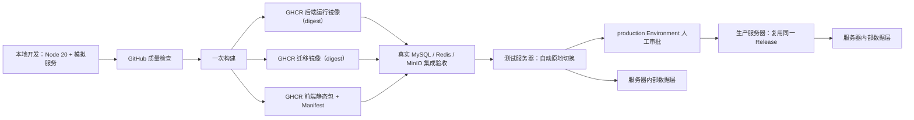

# 发布与服务器架构 v2

状态：仓库侧发布链路已建立，测试服务器已完成接管并自动发布；生产服务器完成本文的一次性准备后再启用发布。

本文是“前端静态包 + 后端不可变镜像、服务器内置独立数据层、宿主 Nginx 原地切换”的操作基线。旧版 `deploy-git.sh` 和 `.github/workflows/deploy.yml` 仅用于首发前备份或迁移期人工兜底，不再作为日常发布入口。

## 1. 目标架构



每个 Release 用完整 40 位 Git commit SHA 标识。前端、后端和迁移器写入同一份 `release-manifest.json`；后端镜像必须使用 `@sha256:`，测试通过后生产环境不重新构建。Manifest 的 `migrations.expectedCount` 是 v2 迁移数量唯一事实源，部署脚本将其写入 Release 专属环境文件；服务器长期 `runtime.env`、首次配置生成器和接管预检都不得固化该数量。CI 对 `delivery-platform-server` Git 树计算 SHA-256，并优先复用 GHCR 中对应的 `content-<sha256>` runtime 和 migrator；只有新后端内容才构建，再为当前 Release 创建 `sha-<commit>` 别名并核对两者解析到同一 digest。所有 Release 全局串行，避免相同内容并发首建。迁移镜像继承同一 Release 的精简后端运行镜像，只增加固定版本的 Prisma、ts-node 和 TypeScript 命令层，使用独立 GHA cache scope，不携带 builder 的编译工具链和完整开发依赖。`RELEASE_ID` 由 Release 环境文件在容器启动时注入，不写入 Dockerfile 的 ARG、ENV 或 Label；首次内容构建还固定 `SOURCE_DATE_EPOCH=0`，消除镜像索引、配置和文件元数据中的构建时钟漂移。因此后端内容未变化时不同 Release 引用完全相同的不可变镜像 digest，发布身份仍由 Manifest、前端 `build-info.json` 和运行环境共同绑定。

服务器拓扑固定为：

- 宿主 Nginx：直接读取 `/srv/delivery-platform/current/frontend`，并反向代理到 `127.0.0.1:3000`。
- 应用层 Compose：NestJS API、文件 Worker、Outbox Worker、一次性迁移器。
- 数据层 Compose：MySQL、Redis、MinIO，独立命名卷和独立 Docker 网络。
- 数据端口只绑定 `127.0.0.1`；不向公网暴露 3306、6379、9000、9001。
- 前端切换是原子符号链接替换；应用切换允许数分钟停写窗口。
- 每次 migration 前成对备份 MySQL 和 MinIO。migration 已开始后禁止只回退代码；必须恢复同一备份中的数据、后端和前端。

## 2. 发布路径

日常路径：

1. `main` 的“质量检查”成功。
2. `.github/workflows/release.yml` 构建两个镜像和一个静态包。
3. CI 使用这些正式发布物完成真实 API、权限和浏览器 E2E。
4. `RELEASE_V2_ENABLED=true` 时自动部署 GitHub Environment `test`。
5. 测试成功后生成不可变 `tested-release` 凭据。
6. 人工运行“推广已验收 Release 到生产”，输入完整 SHA。
7. GitHub Environment `production` 的审批人确认后，同一 Release 原地切换到生产。

旧 `.github/workflows/deploy.yml` 已改为仅手动触发，并要求输入 `confirm_legacy_reset=YES`；不要把它重新设为 push 自动触发。

## 3. 环境地址规划

先由网络或运维人员填写下面四个地址，测试和生产不得复用域名、证书或凭据：

| 环境 | 内网入口 | 公网入口 | SSH 入口 |
| --- | --- | --- | --- |
| test | `http(s)://<test-internal-host>` | `https://<test-public-host>` | `<test-ssh-host>:<port>` |
| production | `http(s)://<prod-internal-host>` | `https://<prod-public-host>` | `<prod-ssh-host>:<port>` |

要求：

- `INTERNAL_ORIGIN` 和 `PUBLIC_ORIGIN` 都必须能从对应服务器访问，并通过同一宿主 Nginx 到达当前 Release。
- 公网入口必须使用 HTTPS。内网入口若使用 HTTPS，也必须有服务器信任的证书链。
- GitHub 托管 Runner 必须能连接 SSH 入口；如果生产 SSH 仅内网可达，应改用组织自托管 Runner，不能临时开放数据库或对象存储端口。
- DNS 或 `/etc/hosts` 必须在首次切换前准备好。健康检查不会跳过证书验证。

没有域名时，公网入口使用公网 IP 的受信任 HTTPS 证书，不能降级为生产 HTTP。Let’s Encrypt IP 证书使用 `shortlived` profile，有效期约 160 小时；Certbot 必须为 5.4 或更高版本，并至少每 12 小时执行一次自动续期检查。此模式使用：

- 公网：`https://<public-ip>`。
- 服务器内网验证：`http://127.0.0.1:8081`。
- 80 端口：只服务 `/.well-known/acme-challenge/`，其他请求跳转 443。
- 模板：`deploy/nginx/delivery-platform-ip-acme-bootstrap.conf.template`、`delivery-platform-ip.conf.template` 和 `delivery-platform-app.inc.template`。
- 自动续期：`deploy/systemd/delivery-platform-certbot-renew.*`。

## 4. 每台服务器的一次性准备

以下命令由有 sudo 权限的运维账号分别在测试、生产服务器执行。示例假设 Linux、Docker Engine、Compose v2 和宿主 Nginx 已安装。

### 4.0 安装并核对服务器工具

发布脚本依赖 Bash、Docker Compose v2、Nginx、`jq`、`curl`、GNU `tar`、`gzip`、`coreutils` 和 `util-linux`。Ubuntu/Debian 示例：

```bash
sudo apt-get update
sudo apt-get install -y jq curl tar gzip util-linux coreutils openssl ca-certificates

docker version
docker compose version
nginx -v
for cmd in docker jq sha256sum tar gzip curl flock realpath stat sudo awk; do
  command -v "$cmd" >/dev/null || { echo "缺少命令: $cmd" >&2; exit 1; }
done
```

RHEL 系发行版使用对应包管理器安装同名能力。必须使用 Compose v2 的 `docker compose` 子命令；不能只安装旧版 `docker-compose`。服务器必须有足够空间同时保存当前 Release、候选 Release、MySQL/MinIO 成对备份和 Docker 镜像。

### 4.1 创建专用系统账号和目录

```bash
sudo useradd --create-home --shell /bin/bash dmpdeploy
sudo usermod -aG docker dmpdeploy
sudo install -d -m 0751 -o dmpdeploy -g dmpdeploy /srv/delivery-platform
sudo -u dmpdeploy install -d -m 0700 \
  /srv/delivery-platform/config \
  /srv/delivery-platform/control \
  /srv/delivery-platform/incoming \
  /srv/delivery-platform/backups \
  /srv/delivery-platform/state
sudo -u dmpdeploy install -d -m 0711 /srv/delivery-platform/releases
```

根目录的 `0751` 和 `releases` 的 `0711` 只允许 Nginx 沿已知路径进入静态文件，不允许列目录；`config`、`backups`、`state` 等仍为 `0700`。发布脚本会把静态目录设为 `0555`、文件设为 `0444`，不会把运行配置或备份暴露给 Nginx。

`dmpdeploy` 只用于 GitHub Actions 发布，不用于人工日常登录。加入 `docker` 组等同于授予宿主高权限，SSH 私钥必须独立、可轮换，不能与管理员个人密钥共用。创建后重新登录一次，使组权限生效。

### 4.2 创建 SSH 发布密钥

在受控管理终端分别为 test 和 production 生成不同密钥：

```bash
ssh-keygen -t ed25519 -a 64 -C dmp-test-github-actions -f dmp-test-deploy
ssh-keygen -t ed25519 -a 64 -C dmp-production-github-actions -f dmp-production-deploy
```

把对应 `.pub` 内容追加到服务器 `/home/dmpdeploy/.ssh/authorized_keys`，目录权限 `0700`、文件权限 `0600`。私钥全文分别保存到 GitHub Environment 的 `DEPLOY_SSH_KEY`，不要提交到仓库或复制到应用目录。

通过服务器控制台核对 SSH host key 指纹，再生成 known_hosts 内容：

```bash
ssh-keyscan -p <ssh-port> -H <ssh-host>
```

输出保存为对应 Environment 的 `DEPLOY_KNOWN_HOSTS`。`ssh-keyscan` 的输出必须与控制台展示的服务器指纹人工比对，不能未经核对直接信任。

### 4.3 安装并授权 Nginx 控制适配器

部署脚本不直接假定 Nginx 由 systemd 管理。将 `deploy/nginx/dmp-nginx-control.template` 复制到服务器，分别把 `__NGINX_BINARY__`、`__NGINX_CONFIG__` 替换为真实绝对路径，再由 root 安装：

```bash
sudo install -m 0755 -o root -g root /path/to/completed-dmp-nginx-control \
  /usr/local/sbin/dmp-nginx-control
sudo /usr/local/sbin/dmp-nginx-control check
```

普通 Debian Nginx 常见值是 `/usr/sbin/nginx` 和 `/etc/nginx/nginx.conf`；宝塔 Nginx 必须使用宝塔自己的二进制与配置路径。适配器只接受 `check`、`reload` 两个固定参数，reload 前会再次执行配置检查。

使用 `sudo visudo -f /etc/sudoers.d/delivery-platform-deploy` 写入：

```text
dmpdeploy ALL=(root) NOPASSWD: /usr/local/sbin/dmp-nginx-control check
dmpdeploy ALL=(root) NOPASSWD: /usr/local/sbin/dmp-nginx-control reload
```

然后执行：

```bash
sudo chmod 0440 /etc/sudoers.d/delivery-platform-deploy
sudo visudo -cf /etc/sudoers.d/delivery-platform-deploy
sudo -u dmpdeploy sudo -n /usr/local/sbin/dmp-nginx-control check
```

不要授予无参数限制的 Nginx、`systemctl`、shell 或编辑 Nginx 配置的 sudo 权限。控制适配器必须保持 `755 root:root`，不得由 `dmpdeploy` 修改。

### 4.4 写入服务器身份

每台服务器生成不同的稳定标识，并通过服务器控制台记录：

```bash
openssl rand -hex 16 | sudo -u dmpdeploy tee /srv/delivery-platform/state/target-id
sudo chmod 0600 /srv/delivery-platform/state/target-id
```

把完整输出保存到对应 GitHub Environment 的 `DEPLOY_TARGET_ID`。工作流和服务器脚本会双向核对，防止把生产 Release 发到测试机或相反。

### 4.5 创建运行配置

接管仍在运行的旧 Docker 栈时，优先手动运行 Actions 中的“安全迁移服务器运行配置”，选择对应 Environment 并填写旧 Compose project 名称。工作流以 `dmpdeploy` 身份运行 `scripts/release/bootstrap-runtime-config.sh`，从旧容器的实际环境和挂载中保留数据库、Redis、MinIO、JWT、集成加密密钥与真实数据卷；它不读取旧 `.env`、不记录秘密、不改动旧容器，并在 `runtime.env` 已存在或值无法无损迁移时 fail closed。完成后仍必须执行服务器接管预检。

新服务器或自动迁移 fail closed 时，把仓库的 `deploy/runtime-config.template` 安全复制到服务器临时位置，再执行：

```bash
sudo -u dmpdeploy install -m 0600 /path/to/runtime-config.template \
  /srv/delivery-platform/config/runtime.env
sudo -u dmpdeploy editor /srv/delivery-platform/config/runtime.env
```

逐项替换全部 `<...>`。密码和密钥应由密码管理器生成并保存；最低要求为每个环境独立、随机且不复用。`INTEGRATION_SECRET_ENCRYPTION_KEY` 必须是 32 字节 Base64，创建后不可随普通发布轮换：

```bash
openssl rand -base64 32
```

校验占位符和权限：

```bash
sudo -u dmpdeploy grep -n '<' /srv/delivery-platform/config/runtime.env
sudo stat -c '%a %U:%G %n' /srv/delivery-platform/config/runtime.env
```

第一条必须无输出，第二条必须为 `600 dmpdeploy:dmpdeploy`。不要把该文件内容发到聊天、工单或 CI 日志。

应用种子账号由迁移器创建，密码不会写在仓库中：

- `admin` 使用 `SEED_ADMIN_PASSWORD`。
- 服务器 seed 安全默认只创建 `admin`，并跳过示例项目。演示账号和示例项目仅在隔离 CI 通过 `SEED_INCLUDE_DEMO_DATA=true` 显式启用；测试与生产服务器不得启用该变量。
- 隔离 CI 中的 `delivery_mgr`、`pm_wang`、`pm_li`、电气、软件、采购、财务、标准管理员和合作方演示账号使用 `SEED_DEFAULT_PASSWORD`，也可以通过各角色专用变量分别设置。
- 既有账号默认不重置密码；`SEED_RESET_EXISTING_USER_PASSWORDS=false` 必须保持不变。只有明确的受控密码轮换窗口才临时设为 `true`，完成后立即恢复为 `false`。

### 4.6 安装宿主 Nginx 配置

先复制 `deploy/nginx/delivery-platform-app.inc.template`，替换：

- `__APP_ROOT__` → `/srv/delivery-platform`
- `__BACKEND_PORT__` → `3000` 或运行配置中的 `BACKEND_HOST_PORT`

将其安装为 `/etc/nginx/snippets/delivery-platform-app.inc`。有域名时再复制 `deploy/nginx/delivery-platform.conf.template`，替换：

- `__PUBLIC_HOSTNAME__`、`__INTERNAL_HOSTNAME__` → 本环境两个主机名

域名 HTTPS server 在证书指令后包含同一个 `/etc/nginx/snippets/delivery-platform-app.inc`。公网 443 server 因此与 HTTP 入口共用 `root`、缓存规则、`client_max_body_size 501m` 和 `/api/` 代理规则。这里的 501 MiB 是 multipart 请求包络上限；后端仍严格限制单个文件为 500 MiB。测试配置后再 reload：

```bash
sudo /usr/local/sbin/dmp-nginx-control check
sudo /usr/local/sbin/dmp-nginx-control reload
```

首次接管旧架构时不要提前启用指向 `current/frontend` 的配置；按第 7 节在停机窗口内启用。

无域名时不要使用上述域名模板，按 [服务器接管操作单](server-handover-checklist.md) 的 IP HTTPS 步骤，先启用仅包含 ACME challenge 的引导配置，取得受信任 IP 证书后再启用 443 和 `127.0.0.1:8081` 两个应用入口。

## 5. GitHub Environment 配置

创建两个 Environment：`test`、`production`。变量与密钥必须分别配置，不能使用仓库级生产密钥。

Variables：

| 名称 | 示例含义 |
| --- | --- |
| `DEPLOY_HOST` | GitHub Runner 可达的 SSH 地址 |
| `DEPLOY_PORT` | SSH 端口，默认 `22` |
| `DEPLOY_USER` | 固定为 `dmpdeploy` |
| `DEPLOY_APP_ROOT` | 固定为 `/srv/delivery-platform` |
| `DEPLOY_TARGET_ID` | 第 4.4 节的服务器身份 |
| `INTERNAL_ORIGIN` | 第 3 节的内网完整 origin |
| `PUBLIC_ORIGIN` | 第 3 节的公网 HTTPS origin |

Secrets：

- `DEPLOY_SSH_KEY`：该环境独立的私钥全文。
- `DEPLOY_KNOWN_HOSTS`：已线下核对的 host key 行。

不需要创建长期 GHCR PAT。部署作业会把当前 job 的短期 `GITHUB_TOKEN` 通过已校验 host key 的 SSH 标准输入交给目标服务器执行 `docker login`，完成或失败后都执行 `docker logout ghcr.io`；退出凭据失败会使 job 失败，不能记录为发布成功。服务器不得手工保存个人 GitHub Token；首次接管前只需确认 `dmpdeploy` 能运行 Docker，且仓库关联的 GHCR package 允许该工作流读取。

仓库级 Variable：

- 首次切换前保持 `RELEASE_V2_ENABLED=false`。
- 测试服务器准备完成并进入第 7 节窗口时改为 `true`。

保护规则：

- `test`：日常不要求审批，实现 main 通过后自动部署；首次切换时临时添加审批人。
- `production`：始终设置 Required reviewers，并禁止管理员绕过。生产发布只能使用“推广已验收 Release 到生产”。

Environment 配置完成后，先手动运行“服务器接管预检”，输入环境名和已通过 Release 验收的完整 SHA。预检会验证 SSH、服务器身份、权限、运行配置、旧数据卷、Compose、Nginx、内外网 ready 和私有 GHCR 镜像读取能力，但不会改变容器或卷状态。预检 PASS 前不得启用 `RELEASE_V2_ENABLED`。

如果目标 Release 已经完成构建和真实集成验收，但当时因 `RELEASE_V2_ENABLED=false` 跳过了测试部署，接管时运行“部署已存在 Release 到测试”，输入同一完整 SHA。该流程先从 GHCR 下载并校验既有 Manifest 和前端包，再调用统一部署流程；它禁止重新构建镜像或静态包，部署成功后发布 production 推广所需的 `tested-release` 凭据。

## 6. 新服务器首次发布

没有旧数据的新服务器可直接执行：

1. 完成第 3～5 节。
2. 先给 `test` Environment 添加临时审批人。
3. 设置 `RELEASE_V2_ENABLED=true`，手动运行“构建并发布不可变 Release”。
4. 等待 build 和 integration 成功，部署作业进入 Environment 审批。
5. 启用 Nginx v2 配置并批准部署。
6. 核对 GitHub deploy、外网 `build-info.json`、`/api/v1/ready` 和登录。
7. 用 Nginx Worker 的真实系统账号执行 `test -r /srv/delivery-platform/current/frontend/index.html`，确认静态文件可读。
8. 测试稳定后移除 `test` 临时审批；生产环境仍保留审批。

## 7. 旧 Docker 全栈首次接管

本步骤会产生数分钟停机，分别在测试、生产维护窗口执行。生产必须先在测试完整演练一次。

### 7.1 发布物先构建，不先停服务

保持 `RELEASE_V2_ENABLED=false`，把目标提交合入 main，确认“质量检查”和“构建并发布不可变 Release”的 build、integration 成功。然后临时给目标 Environment 增加审批人，并把 `RELEASE_V2_ENABLED` 改为 `true`，对同一完整 SHA 手动运行 Release 工作流。等到 deploy 作业等待审批后再进入停机窗口。

### 7.2 备份旧架构

在旧应用目录执行旧脚本的只读状态和成对备份：

```bash
bash deploy-git.sh status
bash deploy-git.sh backup
```

记录输出的备份绝对路径，并验证目录内 checksums、MySQL gzip 和 MinIO tar。没有有效备份不得继续。

### 7.3 识别并沿用现有命名卷

先只读检查旧容器挂载：

```bash
docker inspect delivery-mysql --format '{{range .Mounts}}{{println .Name .Destination}}{{end}}'
docker inspect delivery-redis --format '{{range .Mounts}}{{println .Name .Destination}}{{end}}'
docker inspect delivery-minio --format '{{range .Mounts}}{{println .Name .Destination}}{{end}}'
```

把 `/var/lib/mysql`、`/data` 对应的三个真实卷名分别写入新 `runtime.env` 的 `MYSQL_VOLUME_NAME`、`REDIS_VOLUME_NAME`、`MINIO_VOLUME_NAME`。不要创建空卷替代，不要复制运行中的数据库目录。

### 7.4 停止旧栈并切换

确认 Release deploy 仍在等待审批后：

1. 停止并移除旧 Compose 容器，但绝对不要加 `-v`。
2. 再次运行 `docker volume inspect <三个卷名>`，确认卷仍存在。
3. 启用宿主 Nginx v2 配置；此时短暂 404/503 属于维护窗口。
4. 批准 GitHub Environment 部署。
5. 新部署脚本会用原卷启动数据层、再做一次 v2 成对备份、执行 migration、启动 API/Worker、原子切换前端并验证内外网入口。

首发 strict dry-run 若报告 `TARGET_CONTENT_AGGREGATE_WITHOUT_VERSION`，不得启动旧应用或做代码单独回滚。新版内容 migrator 只对状态可识别的无版本 Standard 做无删除恢复：使用稳定 ID 创建 `V1.0`，通过 MinIO 实体、SHA-256、文件索引和 published pointer 校验后才允许继续；任何未知状态、ID 冲突或对象冲突仍阻断。CI 的真实集成验收会在生成测试数据后再次执行内容迁移的 strict dry-run、apply、strict verify，避免下一次发布重新遇到同类数据；服务器发布只执行正式基础种子，不生成演示测试数据。

若测试服务器明确为可销毁环境，可手动运行“部署已存在 Release 到测试”，把 `reset_test_data` 设为 `true`。该选项只允许 `test` Environment：作业核对服务器 target-id、runtime 文件权限及 Compose 解析出的三个命名卷，停止应用后执行数据层 `down --volumes --remove-orphans`，逐卷确认已删除，再在同一次发布中创建空数据层、执行迁移和正式基础种子。production 调用传入该选项会立即失败；生产数据重置不属于自动发布能力。

旧 Compose 的具体 `-f` 参数必须沿用服务器原来的启动参数。例如原来是：

```bash
docker compose --env-file <server-runtime-file> \
  -f docker-compose.yml -f docker-compose.prod.yml down --remove-orphans
```

生产和日常发布只允许 `down --remove-orphans`；禁止 `down -v`、`docker volume prune`、删除旧备份或删除三个已识别卷。唯一例外是已明确授权为可销毁的 test 环境，通过第 7.4 节受控工作流设置 `reset_test_data=true`；不得人工全局清卷。

### 7.5 首发验收

```bash
sudo -u dmpdeploy /srv/delivery-platform/control/deploy-release.sh status
curl -fsS <internal-origin>/api/v1/ready
curl -fsS <public-origin>/api/v1/ready
curl -fsS <public-origin>/build-info.json
```

再从 Nginx 主配置的 `user` 指令确认 Worker 账号（Ubuntu/Debian 通常是 `www-data`，不能直接照抄），并验证该账号确实能读取当前静态入口：

```bash
sudo -u <nginx-worker-user> test -r /srv/delivery-platform/current/frontend/index.html
```

同时用 `admin` 和一个受限业务账号登录，验证项目列表、档案、文件预览/下载、审核、标准、知识、通知与权限矩阵。测试服务器通过后才可用同一 SHA 运行生产推广。

## 8. 日常发布和回滚

日常测试发布无需 SSH 登录：main 质量门禁成功后自动构建、真实验收并发布 test。生产操作员从测试环境的 `build-info.json` 取得完整 Release 对应 SHA，在 GitHub Actions 手动运行“推广已验收 Release 到生产”，审批时核对变更单、备份空间和维护窗口。

镜像在当前 Release 在线期间预拉取，下载时间不计入停机窗口。测试服务器在缓存失效基线中拉取 135 MiB runtime 与 174 MiB migrator 共耗时 13 分 42 秒，而拉取后的备份、迁移校验、幂等 seed、启动和原子切换约 46 秒；另一次稳定层重建受 GHCR 链路波动影响，36 分钟仍未完成并在停机前安全取消，原 Release 始终保持 `ready`。部署脚本因此给单次拉取设置 20 分钟上限并最多续传重试 3 次；首次内容构建 Release `79e41eb29d40` 的部署受 GHCR 冷拉取影响共耗时 40 分 37 秒，第一次 20 分钟超时后由第二次续传完成，切换窗口仅观察到一次 `502`，11 秒内恢复 `ready`。

同一完整 SHA 的严格复跑证明了日常热路径：runtime 与 migrator 构建均被内容标签命中并跳过，前后两份 Manifest 的镜像 digest 分别稳定为 `sha256:c58245eb2a5bae593565089a1e6859e68dd9c8ce102608a0db60efd542c90d2a` 和 `sha256:966fd1475eb5d07a90dc1a81f8a3081be0b7da959e3a2ceb635182f2224b4de5`；Release 构建 57 秒、真实集成验收 4 分 01 秒、测试部署作业 3 分 50 秒、整条流水线 9 分 09 秒。部署上传控制文件和前端包耗时 2 分 29 秒，服务器端镜像拉取不足 0.2 秒，备份、46 个 migration、三个数据迁移器、幂等 seed、应用启动、健康检查和前端原子切换共 53 秒。工作流按 Release 全局串行且不主动取消正在执行的发布；若人工取消作业或 SSH 会话中断，服务器脚本会把 HUP/INT/TERM 转发给正在拉取的子进程，执行失败清理并释放部署锁。发布性能必须分别记录“预拉取时间”和“停机切换时间”；日常只改前端、文档或部署控制文件时应命中内容镜像，新服务器或后端依赖变化导致的冷拉取仍须提前在维护窗口内完成。

状态查看：

```bash
APP_ROOT=/srv/delivery-platform \
DEPLOY_ENV=test \
DEPLOY_TARGET_ID=<trusted-target-id> \
bash /srv/delivery-platform/control/deploy-release.sh status
```

如果失败发生在 migration 之前，部署脚本会尝试恢复上一 v2 应用。只要 migration 已开始，就不得切换旧镜像或只切前端。

完整成对恢复命令如下，仅在已选定 v2 备份、已完成变更审批且明确接受覆盖当前 MySQL/MinIO 后执行：

```bash
APP_ROOT=/srv/delivery-platform \
DEPLOY_ENV=<test-or-production> \
DEPLOY_TARGET_ID=<trusted-target-id> \
INTERNAL_ORIGIN=<internal-origin> \
PUBLIC_ORIGIN=<public-origin> \
BACKUP_PATH=/srv/delivery-platform/backups/<exact-backup-directory> \
CONFIRM_DATA_RESTORE=RESTORE \
bash /srv/delivery-platform/control/restore-release.sh
```

恢复脚本只接受 `backups` 的直接子目录，先验证全部 checksum，并要求其中包含匹配的 v2 源 Release Manifest 和镜像环境。它会停止应用，清空并恢复受控 MinIO 卷、重建业务数据库、清空 Redis、启动匹配的后端和前端，再验证内外网入口。旧架构首发前产生的 legacy 备份不允许用 v2 脚本自动恢复，必须按旧 `deploy-git.sh restore-data` 流程处理。

`state/data-restore-incomplete` 存在时不得人工启动应用；先排查恢复失败原因并用同一备份重试。

## 9. 备份、监控和保留策略

- 发布备份默认放在 `/srv/delivery-platform/backups`，目录权限 `0700`。
- 当前 v2 不自动删除备份；先配置服务器容量告警和异机备份，再引入经过验收的保留清理任务。
- 至少监控：根分区/数据卷空间、MySQL/Redis/MinIO health、API `/ready`、Worker 重启次数、Nginx 5xx、备份失败和 `state/*incomplete` 标记。
- MySQL、Redis、MinIO 数据仍在服务器内部，但生命周期与应用 Release 分离；应用发布不执行 `down -v`。
- 500 MiB 是统一的单文件硬上限。本阶段继续使用现有流式上传方式，不引入分片或断点续传；Nginx 使用 501 MiB 请求包络上限容纳 multipart 元数据，后端和文件处理仍只接受最多 500 MiB 的文件正文。

## 10. 验收清单

测试和生产每次首次接管都必须逐项记录真实 PASS/FAIL：

- GitHub quality、build、integration。
- Manifest SHA、后端/迁移器 digest、前端 checksum。
- 服务器 target-id、runtime.env 权限、Compose config。
- migration、MySQL/MinIO 成对备份。
- API 和 Worker 健康。
- 内网、公网 `/api/v1/ready`。
- 内网、公网 `build-info.json.releaseId` 与目标 SHA 前 12 位一致。
- 管理员与受限账号关键业务路径。
- production 审批记录和回滚备份路径。

任何一项失败都不记录为发布成功。

两台既有服务器的逐步回传表、脱敏边界和 GitHub 页面操作顺序见 [服务器接管操作单](server-handover-checklist.md)。
