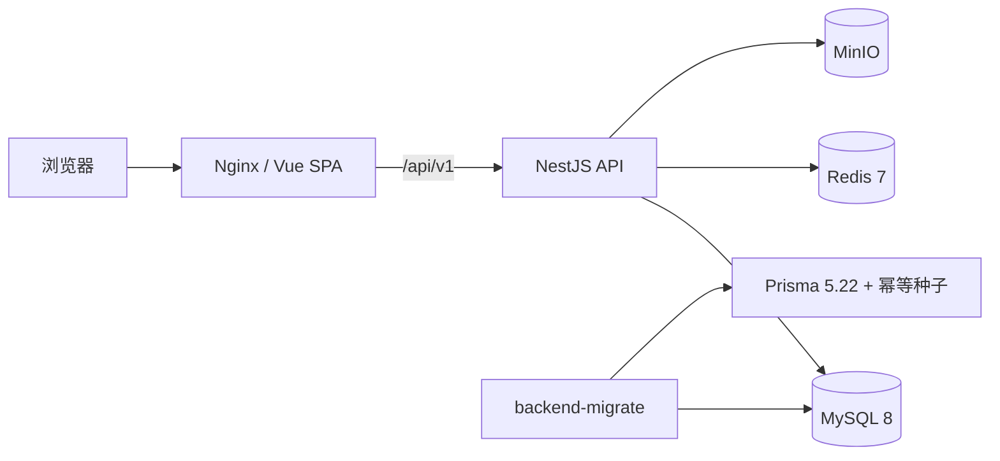

# 系统架构

## 总览

前端、后端和迁移工具分别构建为容器。Nginx 提供静态文件并反向代理 API；后端只监听服务器回环地址；MySQL、Redis 和 MinIO 使用 Docker 数据卷持久化。

## 前端

- `layouts/BasicLayout.vue`：侧栏、顶栏和内容区。
- `router/index.ts`：路由与菜单定义。
- `router/permission.ts`：登录状态和路由权限。
- `store/`：用户、权限、语言和应用状态。
- `api/`：统一 Axios 请求层。
- `views/`：按业务模块组织的页面。
- `styles/global.scss`：设计令牌、Element Plus 主题和页面兼容层。

前端使用 Hash Router，发布后由 Nginx 统一提供 `index.html`。页面与版本信息禁止缓存，带哈希的静态资源长期缓存。

## 后端

后端共有 29 个 NestJS 业务模块：

- 身份权限：auth、user、role、permission
- 项目：project、project-member、project-payment、project-process
- 档案文件：archive-template、project-archive、file、attachment、review
- 标准知识：checklist、workflow、template、knowledge、tool
- 团队运营：report、okr、platform、notification
- 系统设置：country、currency、language、operation-log、system-config、dashboard

所有接口统一挂载在 `/api/v1`，由全局校验管道、异常过滤器和响应拦截器处理。Swagger 位于 `/api/docs`。

## 请求链路

1. 前端 Axios 附加 JWT。
2. `JwtAuthGuard` 验证身份。
3. `RolesGuard` 和 `PermissionsGuard` 验证角色与权限。
4. Service 执行业务规则、项目数据范围和 Prisma 查询。
5. 敏感操作或写操作记录到 `operation_logs`。
6. `TransformInterceptor` 返回 `{ code, message, data, timestamp }`。

## 发布架构

- Node：20
- pnpm：10.34.4
- Prisma CLI 与 Client：5.22.0
- 前端生产镜像：Nginx
- 后端生产镜像：只保留运行依赖
- 迁移镜像：使用 builder 阶段，包含 Prisma 和 ts-node

每个发布包包含 `RELEASE_ID`。Docker 构建将版本写入镜像和 `/build-info.json`，部署后必须验证线上版本一致。
