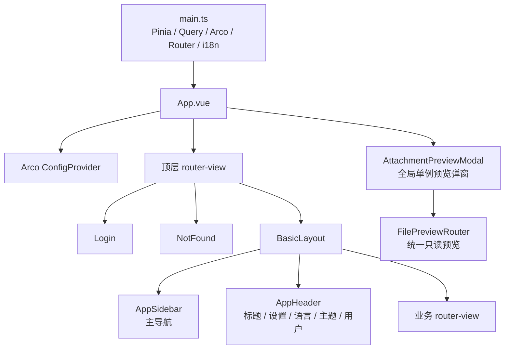

# 前端页面架构

## 文档定位

本文是交付管理平台前端的当前实现基线，记录当前工作树中已经存在的页面、路由、状态、请求、权限和文件预览实现，作为开发、评审和验收的统一依据。

- 基线日期：2026-07-16。
- 源码范围：`delivery-platform-web/src/`。
- 技术栈：Vue 3、TypeScript、Vite、Pinia、Vue Router、TanStack Query、Arco Design Vue。
- 业务流程与状态流转见 [前端业务流程](frontend-business-flows.md)。
- 系统级边界见 [总体架构](architecture.md)，测试环境与命令见 [测试与验收](testing.md)。

本文中的“可见”分为三种：左侧主导航可见、右上角设置菜单可见、仅可通过深链访问。菜单可见不等于数据可见，数据范围始终由后端过滤。

## 1. 当前规模与边界

| 项目                   | 当前数量 | 说明                                            |
| ---------------------- | -------: | ----------------------------------------------- |
| 左侧主导航组           |        3 | 工作台、项目管理、标准与知识                    |
| 左侧主导航叶子         |        8 | 由 `shellRoutes` 自动生成并按权限过滤           |
| 右上角设置入口         |        6 | 齿轮下拉菜单，不进入左侧导航                    |
| 深链业务入口           |       10 | 项目 3、审核/标准/知识/档案模版 4、组织权限 3   |
| 路由引用的唯一页面 SFC |       19 | 含登录与 404，不含布局和页面内组件              |
| `views/` 下 Vue 文件   |       30 | 19 个路由页面、2 个项目抽屉视图、9 个页面内组件 |
| 跨页业务组件           |       20 | 18 个 `business/` 组件及 2 个统一文件预览组件   |
| Pinia Store            |        4 | 用户、权限、应用外观、语言                      |
| Query composable       |        6 | 看板、项目、档案、内容、运营设置、组织权限      |
| 运行时 API 文件        |       25 | 不含测试                                        |
| 前端单元/组件测试文件  |       40 | Vitest + jsdom，另有真实 API Playwright 冒烟    |

当前信息架构包含项目交付、档案、审核、标准、知识、工具和六类设置。

## 2. 应用启动与渲染层级

`main.ts` 依次安装 Pinia、主题、TanStack Query、Arco Design、Router 和 i18n。`App.vue` 只承载 Arco 语言环境、顶层路由出口和全局文件预览弹窗。



启动时还会执行两项会话与外观初始化：

1. `clearLegacyAuthStorage()` 清理旧的本地认证键；当前 Access Token 只保存在内存中。
2. `useAppStore().initializeTheme()` 读取主题偏好并监听系统深浅色变化。

## 3. 应用壳与布局

### 3.1 `BasicLayout`

- 页面使用 `100dvh` 工作台壳，左侧导航、48px 顶栏和内部滚动内容区互相独立。
- 侧栏展开 240px、收起 64px；900px 及以下变为覆盖式抽屉。
- 内容区在大屏、桌面、平板和手机分别使用 24px、20px、16px、12px 边距。
- 页面全宽展示，不设置统一 `max-width`，不显示面包屑。
- 当前路由标题读取 `route.meta.title` 对应的 i18n key，浏览器标题同步为“页面标题 - 平台名称”。
- 页面没有全局 `keep-alive`；列表筛选主要依赖 URL 和 Query 缓存恢复。

### 3.2 `AppSidebar`

- 菜单数据不是第二份静态配置，而是由 `shellRoutes` 中的 `navigationGroup`、`menu`、`order`、`permissions` 生成。
- 组内使用 Arco `a-sub-menu`，只保留至少有一个可访问叶子的分组。
- 激活项采用最长路径前缀匹配，因此项目详情深链仍高亮 `/projects`。
- 移动端选择菜单后自动收起侧栏。

### 3.3 `AppHeader`

- 左侧显示侧栏切换和当前页面标题。
- 右侧依次为设置齿轮、中英文切换、浅色/深色/跟随系统切换、用户菜单和退出。
- 齿轮始终显示；下拉内容按当前用户的设置权限过滤，无可访问设置时显示空提示。
- 头部没有通知中心入口；看板中的系统通知只作为待办数据展示。

## 4. 路由与导航单一来源

### 4.1 路由规则

- 使用 `createWebHashHistory()`，部署 URL 采用 hash 路由。
- `/login` 和 404 位于业务壳外，其余页面位于 `BasicLayout` 下。
- `shellRoutes` 同时提供路由注册、菜单分组、标题、图标、顺序和路由权限。
- `buildNavigationFromRoutes()` 生成 `menuItems` 和 `settingItems`。
- `meta.permissions` 是“任一权限满足即可”；`SUPER_ADMIN` 绕过前端菜单和路由权限判断。
- 隐藏路由不进入菜单，但与可见路由一样经过登录和权限守卫。

### 4.2 公共路由与重定向

| 路由                   | Route Name       | 结果                                    | 页面文件                      |
| ---------------------- | ---------------- | --------------------------------------- | ----------------------------- |
| `/login`               | `Login`          | 登录页；已有会话时转首个可访问页面      | `src/views/login/index.vue`   |
| `/`                    | —                | 进入 `BasicLayout`，重定向 `/dashboard` | `src/layouts/BasicLayout.vue` |
| `/workspace`           | `WorkspaceGroup` | 重定向 `/dashboard`                     | 无独立页面                    |
| `/delivery`            | `DeliveryGroup`  | 重定向 `/projects`                      | 无独立页面                    |
| `/standards-knowledge` | `KnowledgeGroup` | 重定向 `/standards`                     | 无独立页面                    |
| `/settings`            | `SettingsGroup`  | 重定向 `/settings/currency`             | 无独立页面                    |
| `/:pathMatch(.*)*`     | `NotFound`       | 404                                     | `src/views/NotFound.vue`      |

### 4.3 左侧主导航：8 个页面

| 分组       | 菜单/路由                    | Route Name        | 页面文件                         | 路由权限                 |
| ---------- | ---------------------------- | ----------------- | -------------------------------- | ------------------------ |
| 工作台     | 数据看板 `/dashboard`        | `Dashboard`       | `src/views/dashboard/index.vue`  | `dashboard:view`         |
| 工作台     | 文件审核 `/review`           | `Review`          | `src/views/review/pending.vue`   | 无；所有已登录用户可进入 |
| 项目管理   | 项目概览 `/projects`         | `Project`         | `src/views/project/index.vue`    | `project:view`           |
| 项目管理   | 项目档案 `/archive`          | `Archive`         | `src/views/archive/index.vue`    | `archive:view`           |
| 项目管理   | 档案模版 `/archive-template` | `ArchiveTemplate` | `src/views/archive/template.vue` | `archive_template:view`  |
| 标准与知识 | 标准库 `/standards`          | `Standard`        | `src/views/standard/index.vue`   | `standard:view`          |
| 标准与知识 | 知识库 `/knowledge`          | `Knowledge`       | `src/views/knowledge/index.vue`  | `knowledge:view`         |
| 标准与知识 | 工具中心 `/tools`            | `Tools`           | `src/views/tools/index.vue`      | `tools:view`             |

项目概览页面由四张统计筛选卡、统一视图选择器、附着式搜索工具栏和 `BusinessTable` 组成。视图选择器通过 `scope` 与 `view` URL query 管理“我的项目”“全部项目”“归档项目”，页面沿用真实项目配置、后端数据范围和敏感字段裁剪结果。

### 4.4 右上角设置：6 个页面

| 设置项/路由                        | Route Name      | 页面文件                            | 路由权限                                               | 修改权限                   |
| ---------------------------------- | --------------- | ----------------------------------- | ------------------------------------------------------ | -------------------------- |
| 币种与汇率 `/settings/currency`    | `Currency`      | `src/views/currency/index.vue`      | `currency:view` 或 `currency:manage`                   | `currency:manage`          |
| 通知规则 `/settings/notifications` | `Notifications` | `src/views/system/notification.vue` | `notification_rule:view` 或 `notification_rule:manage` | `notification_rule:manage` |
| 审批配置 `/settings/approvals`     | `Approvals`     | `src/views/system/approvals.vue`    | `approval_config:view` 或 `approval_config:manage`     | `approval_config:manage`   |
| 操作日志 `/settings/logs`          | `Logs`          | `src/views/system/logs.vue`         | `audit_log:view`                                       | 只读                       |
| 系统配置 `/settings/system`        | `SystemConfig`  | `src/views/system/config.vue`       | `system_setting:view` 或 `system_setting:manage`       | `system_setting:manage`    |
| 接口集成 `/settings/integrations`  | `Integrations`  | `src/views/system/integrations.vue` | `integration:view` 或 `integration:manage`             | `integration:manage`       |

### 4.5 深链路由：10 个页面入口

| 路由                        | Route Name      | 实际组件                                 | 展示方式                                            | 路由权限          |
| --------------------------- | --------------- | ---------------------------------------- | --------------------------------------------------- | ----------------- |
| `/projects/create`          | `ProjectCreate` | `src/views/project/index.vue`            | 自动打开 80vw 创建抽屉，内部为 `project/ProjectDrawer.vue` | `project:create`  |
| `/projects/:projectId/edit` | `ProjectEdit`   | `src/views/project/index.vue`            | 自动打开编辑抽屉，内部为 `project/ProjectDrawer.vue`       | `project:update`  |
| `/projects/:projectId`      | `ProjectDetail` | `src/views/project/index.vue`            | 自动打开 800px 居中详情弹窗，内部为 `project/detail.vue` | `project:view`    |
| `/review/:taskId`           | `ReviewDetail`  | `src/views/review/pending.vue`           | 保留列表 query 并自动打开审核详情抽屉               | 登录即可进入      |
| `/archive-templates/:templateId` | `ArchiveTemplateDetail` | `src/views/archive/template.vue` | 自动打开模版版本详情抽屉                       | `archive_template:view` |
| `/standards/:id`            | `StandardDetail` | `src/views/standard/index.vue`          | 自动打开标准详情抽屉                                | `standard:view`   |
| `/knowledge/:id`            | `KnowledgeDetail` | `src/views/knowledge/index.vue`        | 自动打开知识详情抽屉                                | `knowledge:view`  |
| `/organization/departments` | `Departments`   | `src/views/organization/departments.vue` | 仅深链                                              | `department:view` |
| `/organization/users`       | `Users`         | `src/views/system/user/index.vue`        | 仅深链                                              | `user:view`       |
| `/organization/roles`       | `Roles`         | `src/views/system/role/index.vue`        | 仅深链                                              | `role:view`       |

组织、用户和角色页面不进入主导航或设置菜单。维护按钮分别按 `department:manage`、`user:*` 和 `role:*` 动作权限显示；后端仍执行最终权限与数据校验。

## 5. 页面文件与组件清单

除上表中的 19 个唯一路由页面外，`views/` 中还有以下 11 个当前使用文件，共计 30 个 Vue 文件：

| 类型         | 文件                                           | 当前职责                               |
| ------------ | ---------------------------------------------- | -------------------------------------- |
| 项目抽屉视图 | `src/views/project/ProjectDrawer.vue`          | 创建与编辑共用表单                     |
| 项目弹窗视图 | `src/views/project/detail.vue`                 | 项目基本信息、阶段合同、团队、风险档案及权限操作 |
| 看板组件     | `DashboardOverviewBand.vue`                    | 欢迎语、角色说明和三项重点数量         |
| 看板组件     | `DashboardSection.vue`                         | 区块 loading/error/retry 外壳          |
| 看板组件     | `StatCards.vue`                                | 项目统计卡                             |
| 看板组件     | `DashboardTasks.vue`                           | 我的待办与跨模块跳转                   |
| 看板组件     | `HighRiskProjects.vue`                         | 高风险项目                             |
| 看板组件     | `RecentProjects.vue`                           | 近期项目                               |
| 看板组件     | `RecentActivities.vue`                         | 脱敏近期活动                           |
| 审核组件     | `src/views/review/components/ReviewDialog.vue` | 当前审核步骤通过/驳回                  |
| 用户组件     | `src/views/system/user/UserFormDialog.vue`     | 用户新增与编辑表单                     |

`components/` 分为两类：

| 组件层 | 当前职责 |
| ------ | -------- |
| `AttachmentPreviewModal`、`FilePreviewRouter` | 根节点全局单例弹窗与统一只读 Viewer 路由 |
| `components/business/` | `PageContainer`、`PageToolbar`、`SectionCard`、`StatCard`、`BusinessTable`、`BusinessDrawer`、`BusinessModal`、`StatusBadge`、`FileTypeBadge`、`FormSection`、`FormGrid`、`ReadonlyField`、`LoadingState`、`EmptyState`、`ErrorState`、`PermissionDeniedState`、`Can`、`StickyActionBar` |

`BusinessTable` 是声明式 `a-table-column` 的唯一页面入口：它把默认列槽、`#columns`、`v-for` 动态列及 kebab-case 列属性转换为 Arco `TableColumnData`，同时支持显式 `columns` 数组与具名 cell slot。页面不得新增直接声明式 `a-table`；显式数组列的领域表格可继续直接使用 Arco。

## 6. 页面域与交互形态

| 业务域   | 主要页面形态                          | 当前核心能力                                               |
| -------- | ------------------------------------- | ---------------------------------------------------------- |
| 数据看板 | 分区看板                              | 5 个独立数据源、分区错误重试、待办与项目跳转               |
| 文件审核 | 统计 + 筛选表格 + 详情抽屉 + 审核弹窗 | 任务列表、步骤/指派人/历史、只读预览、通过/驳回            |
| 项目     | 统计 + 表格 + 80vw 抽屉               | 我的/全部范围、分类与关键词、创建/编辑/查看、统一进度、归档列表 |
| 项目档案 | 项目选择 + 两级目录 + 多个操作弹窗    | 快照目录、上传版本、临时项、仅新增同步、归档/恢复、预览    |
| 档案模版 | 列表 + 80vw 版本抽屉                  | 模版创建、草稿结构、版本、提交审核、发布、停用             |
| 标准库   | 统计 + 表格 + 详情抽屉 + 编辑弹窗     | 文件正文、不可变版本、关系、审核、归档、预览/下载           |
| 知识库   | 统计 + 表格 + 详情抽屉 + 编辑弹窗     | 文件/Markdown/链接、附件、版本、审核、归档、预览/下载      |
| 工具中心 | 分类侧栏 + 卡片目录 + 配置弹窗        | 内部/外部工具打开、管理、启停、JSON 配置                   |
| 设置     | 表格或分段表单                        | 六类平台配置，查看与管理权限分离                           |

项目、审核任务、档案模版、标准和知识的查看意图均使用 path 参数形成可分享深链；标准和知识创建使用 `?mode=create`。筛选、分页、排序及档案模版版本选择使用 query 参数，并在打开/关闭弹窗或抽屉时保留列表状态。

## 7. 目录职责

| 目录                   | 当前职责                                            |
| ---------------------- | --------------------------------------------------- |
| `api/`                 | 统一请求客户端、领域 API、文件上传幂等键            |
| `components/`          | 统一文件预览与可复用业务展示/权限组件                |
| `composables/`         | 认证、权限、全局文件预览状态                        |
| `composables/queries/` | 按业务域封装服务端查询                              |
| `layouts/`             | 工作台壳、侧栏和顶栏                                |
| `locales/`             | 中英文 i18n 资源和初始化                            |
| `query/`               | QueryClient 默认策略和全局 Query Key 工厂           |
| `router/`              | 路由注册、菜单生成、登录与权限守卫                  |
| `store/`               | 仅保存会话、权限、主题/侧栏和语言                   |
| `styles/`              | 设计 token、全局 Arco 覆盖和响应式规则              |
| `types/`               | API 与页面共享 TypeScript 类型                      |
| `utils/`               | 对话框、下载、本地化、安全 Markdown、格式化等纯工具 |
| `views/`               | 页面协调、页面内 mutation 和局部组件                |

当前没有额外 `features/` 目录；跨域展示与权限能力已沉淀到 `components/business/`，领域查询位于 `composables/queries/`，复杂业务编排仍由对应页面负责。

## 8. 状态管理与 TanStack Query

### 8.1 Pinia 状态

| Store        | 状态                                                    | 持久化                                           |
| ------------ | ------------------------------------------------------- | ------------------------------------------------ |
| `user`       | 内存 Access Token、用户资料、角色、权限、会话初始化状态 | Access Token 不持久化；刷新依赖服务端凭据 Cookie |
| `permission` | 原始菜单、过滤后菜单、权限/角色判断                     | 不持久化；菜单由路由注册表生成                   |
| `app`        | 侧栏收起、主题模式、解析后的主题                        | 主题写入 `delivery-platform:theme`；侧栏不持久化 |
| `locale`     | `zh-CN/en-US`                                           | 写入 `lang`                                      |

退出登录或会话失效时会同时清空 Query 缓存并关闭全局文件预览，避免跨账号复用服务端数据。

### 8.2 QueryClient 默认策略

- 默认 `staleTime` 30 秒，`gcTime` 5 分钟。
- 不在窗口重新聚焦时自动刷新。
- mutation 不自动重试。
- 查询在失败计数达到 2 时停止重试；400、401、403、404、409、422 和标记为不可重试的业务错误不重试。
- 看板项目汇总与近期项目使用 60 秒缓存，其余看板区块使用 30 秒。

### 8.3 Query Key 域

`src/query/keys.ts` 统一定义以下根键：

| 根键                | 数据                                       |
| ------------------- | ------------------------------------------ |
| `dashboard`         | 汇总、待办、风险、近期项目、近期活动       |
| `projects`          | 列表、汇总、详情、回款、引用用户、表单选项 |
| `archive`           | 项目选项、档案树、模版差异                 |
| `archive-templates` | 列表、详情、版本、表单选项                 |
| `file-reviews`      | 列表、汇总、详情、历史                     |
| `standards`         | 列表、汇总、详情、关系、候选标准           |
| `knowledge`         | 列表、汇总、分类、详情                     |
| `tools`             | 工具列表及是否包含停用项                   |
| `currencies`        | 币种与汇率                                 |
| `users` / `roles` / `permissions` / `departments` | 隐藏组织权限页           |
| `settings`          | 系统设置、审批、集成、日志、审计、通知规则 |

分页和筛选对象会复制进 Query Key，mutation 成功后按列表根键、实体详情键或关联键精确失效。

### 8.4 服务端状态边界

当前所有在用业务页面的服务端数据均通过 TanStack Query 获取和失效，包括币种、用户、角色、权限和部门。认证会话继续由 `userStore` 管理，主题、侧栏与语言属于本地 Pinia 状态；全局文件预览可见性由 `useFilePreview` 单例管理，预览会话本身使用 Query。页面临时表单、抽屉开关和上传进度仍保留为局部状态。

## 9. API 与请求架构

### 9.1 统一客户端

`src/api/request.ts` 的行为如下：

- 基础路径 `/api/v1`，默认超时 30 秒，`withCredentials: true`。
- 请求时从内存读取 Access Token，并写入 `Authorization: Bearer ...`。
- 普通响应从 `{ code, message, data, timestamp, traceId }` 解包为 `data`；`traceId` 同时通过 `x-request-id` 响应头返回，用于关联服务端审计与故障排查；Blob 直接返回。
- 同一时刻的多个 401 只共享一次 `/auth/refresh` 请求，刷新成功后重放原请求。
- 刷新失败只执行一次会话清理、过期提示和登录页跳转。
- 403、404、422、429、500、超时和网络断开有统一消息；页面仍可提供更具体的错误态和重试。
- `silent` 用于页面自行呈现错误，`skipAuthRefresh` 用于登录和刷新端点。

### 9.2 领域 API 文件

| API 文件                                     | 当前使用范围                                    | 主要端点前缀                                               |
| -------------------------------------------- | ----------------------------------------------- | ---------------------------------------------------------- |
| `auth.ts`                                    | 登录、退出、资料、刷新                          | `/auth`                                                    |
| `dashboard.ts`                               | 看板五个独立区块                                | `/dashboard`                                               |
| `project.ts` / `project-payment.ts`          | 项目、成员、统一进度、生命周期、归档、回款       | `/projects`、`/project-payments`                           |
| `archive.ts` / `archive-template.ts`         | 项目档案、模版版本和快照同步                    | `/projects/:id/archive-*`、`/archive-templates`            |
| `review.ts`                                  | 统一审核中心                                    | `/file-reviews`                                            |
| `standard.ts`                                | 标准、版本、关系、审核                          | `/standards`、`/standard-versions`                         |
| `knowledge.ts`                               | 知识、版本、分类、审核                          | `/knowledge`、`/knowledge-versions`                        |
| `file.ts`                                    | 详情、下载、预览会话、版本、处理状态、逻辑归档  | `/files`                                                   |
| `tools.ts`                                   | 工具定义及启停                                  | `/tools`                                                   |
| `currency.ts`                                | 币种、汇率同步与锁定                            | `/currencies`                                              |
| `notification.ts`                            | 当前页面使用通知规则；通知列表方法保留在 API 层 | `/notification-rules`、`/notifications`                    |
| `approval.ts`                                | 审批模版                                        | `/approval-templates`                                      |
| `integration.ts`                             | 飞书/企业微信配置、测试、同步、日志             | `/integrations`                                            |
| `system.ts`                                  | 系统设置、系统时间、审计、登录公开配置          | `/system-settings`、`/system-time`、`/audit-logs`          |
| `platform.ts` / `country.ts` / `language.ts` | 字典、部门、角色引用及项目/模版选项             | `/dictionaries`、`/references`、`/countries`、`/languages` |
| `user.ts` / `role.ts` / `permission.ts`      | 隐藏组织权限页                                  | `/users`、`/roles`、`/permissions`                         |
| `upload-idempotency.ts`                      | 档案、标准和知识文件上传幂等                    | 无独立端点                                                 |
| `errors.ts`                                  | 统一业务请求错误类型                            | 无独立端点                                                 |

上传使用同一个 `File` 对象和相同业务操作描述生成稳定的 `Idempotency-Key`。失败重试沿用原键，成功后释放；档案、标准和知识上传均已接入。

## 10. 认证、权限与数据范围

### 10.1 会话恢复

`router.beforeEach` 每次导航都调用 `userStore.ensureSession()`：

1. 已有完整内存会话时直接通过。
2. 有 Access Token 但资料未初始化时请求 `/auth/profile`。
3. 页面刷新后 Access Token 丢失时，只发起一次 `/auth/refresh` 恢复 Token 和用户资料。
4. 恢复失败则跳到 `/login?redirect=原深链`。

登录页只接受站内绝对路径作为 redirect，并拒绝双斜线、反斜线、换行和 404 路径。

### 10.2 四层前端边界

| 层       | 当前实现                                                                                         |
| -------- | ------------------------------------------------------------------------------------------------ |
| 会话     | 路由守卫要求有效会话，登录页是唯一公开业务入口                                                   |
| 页面     | `route.meta.permissions` 任一满足；`SUPER_ADMIN` 绕过                                            |
| 动作     | 页面使用 `usePermission()`、Permission Store 或后端返回的 `canUpload/canArchive/canRestore` 控制 |
| 数据范围 | 前端不下载全量数据再隐藏；列表、引用用户、审核和文件权限由后端按当前用户过滤                     |

前端按钮仅用于减少误操作，不是安全控制。所有项目范围、审核指派、敏感字段、文件下载和设置修改都必须由后端再次校验并记录必要审计。

### 10.3 无权限路由回退

路由权限不足时先提示，再按“左侧主菜单 → 设置菜单 → 无权限页”寻找首个可访问入口。只有设置权限的账号不会被误登出；没有任何可访问页面时进入 `/forbidden`，有效会话仍保留。由于 `/review` 没有路由权限，正常已登录用户通常可回退到文件审核页。

## 11. 统一只读文件预览

### 11.1 单一入口

档案、审核、标准和知识页都调用 `useFilePreview().openPreview({ id, title })`。根节点只创建一个 `AttachmentPreviewModal`，弹窗内部只使用 `FilePreviewRouter`，没有第二套附件预览链路。

`FilePreviewRouter` 调用 `GET /files/:id/preview-session`，根据后端返回的 `viewerType` 和 `availability` 选择 Viewer：

| 后端类型                            | 前端 Viewer       | 当前行为                                                                            |
| ----------------------------------- | ----------------- | ----------------------------------------------------------------------------------- |
| `ONLYOFFICE_VIEW`                   | `onlyoffice`      | Docs URL 与 JWT Secret 完整配置后创建签名只读会话；禁用编辑、批注和审阅，无回调保存 |
| `PDF`                               | `pdf`             | PDF.js，最多渲染前 80 页                                                            |
| `IMAGE`                             | `image`           | Viewer.js 缩放、旋转、全屏                                                          |
| `LARGE_IMAGE`                       | `deep-zoom-image` | OpenSeadragon                                                                       |
| `MARKDOWN`                          | `markdown`        | 自有安全渲染器，转义 HTML 并限制链接协议                                            |
| `CAD_CONVERTED` / `VISIO_CONVERTED` | `pdf`             | 仅在转换产物完成后使用 PDF Viewer                                                   |
| `XMIND`                             | `xmind`           | 展示解析后的工作表大纲                                                              |
| `VIDEO` / `AUDIO`                   | 原生媒体          | 浏览器播放转换产物或音频源                                                          |
| `UNSUPPORTED`                       | `unavailable`     | 明确提示不可预览，在有权限时允许下载                                                |

所有预览会话都固定 `mode: view`、`editable: false`。下载按钮只在后端返回 `downloadAllowed=true` 时显示。

### 11.2 文件处理状态

CAD、Visio、XMind、大图和视频依赖 `FileProcessingJob` 产物。预览会话以 `READY / PROCESSING / UNAVAILABLE` 表达状态：

- `READY` 才路由到实际 Viewer。
- `PROCESSING` 显示“预览产物正在生成”。
- 转换器未配置时任务以稳定码 `FILE_CONVERTER_NOT_CONFIGURED` 失败；任务缺失或其他处理失败也返回显式错误码和安全原因，不把原始 CAD/Visio 文件冒充已转换产物。

后端预览会话包含 `processingStatus`，当前前端将可用性规范化到 Viewer 路由，但不单独调用处理状态端点自动轮询；用户需关闭重开或点击重试获取新状态。

## 12. 主题、语言与视觉

- 主题支持 `light`、`dark`、`system`，默认跟随系统；深色通过 `body[arco-theme=dark]` 和根元素数据属性应用。
- 语言只支持 `zh-CN` 与 `en-US`，切换会同步 Vue i18n、Arco locale、导航标题和浏览器标题。
- 主导航、设置页及大部分核心业务文案使用中英文同构 i18n key。项目表单校验、确认和结果提示，以及部分深链组织权限维护文案仍直接使用中文；业务数据不做自动翻译。
- 全局样式采用企业工作台密度：直角/小圆角、浅边框、少阴影、表格横向滚动和 900px 响应式断点。
- `tsconfig.json` 已启用 `strict`、`strictTemplates`、`noUnusedLocals` 和 `noUnusedParameters`。
- 全局组件库只有 `@arco-design/web-vue`；当前源码没有旧 UI 组件兼容包。

主题机制已经接通，但部分页面样式仍使用固定浅色值，深色模式的完整视觉质量需要真实浏览器逐页验收。

## 13. 错误、空态与当前限制

### 13.1 已形成的共同规则

- 查询页面区分 loading、空数据和错误，并在看板、审核、工具和多数设置页提供重试。
- mutation 默认不自动重试，保存后通过 Query 失效刷新相关列表/详情。
- 驳回、阶段回退、归档和停用等高风险动作要求意见或确认。
- 文件上传有进度、120 秒超时和幂等键。
- 审计详情和集成日志在前端再次对 Secret、Token、密码等字段做脱敏。

### 13.2 明确的运行边界

1. 创建项目必须在 UI 明确选择已发布档案模版；新建项目审批模版仍按国家优先、全局兜底由后端匹配。审批驳回后项目保持草稿，普通编辑不会隐式创建第二个审核任务。
2. 文件处理状态不会在预览弹窗中无限轮询；用户通过重试或重新打开获取最新状态，后端 Worker 负责租约、退避和失败码。
3. 中英文资源 key 保持同构；项目表单提示和部分深链组织权限文案尚未进入 i18n 资源。深色主题机制已统一，但新样式仍须在真实浏览器检查对比度。
4. 标准、知识和档案模版页面保留领域内复杂编排，但共同表格、抽屉、状态、错误/空态和权限展示均复用 `components/business/`。
5. 项目物理删除入口仅向 `SUPER_ADMIN` 且具备 `project:delete` 的用户显示；后端发现文件、审核、财务或审计记录时返回 409，因此日常删除语义仍是软归档。

## 14. 前端验证入口

当前工程使用 Vitest + jsdom，重点覆盖认证刷新、请求拦截、导航生成、设置导航、权限过滤、QueryClient/Query Key、业务组件挂载、上传幂等、文件预览、项目/审核/标准/知识契约及设置表单。Playwright 的 `test:smoke:api` 只验证真实 NestJS 的健康/就绪接口，不替代 UI 浏览器回归。提交前至少执行：

```powershell
pnpm --dir delivery-platform-web type-check
pnpm --dir delivery-platform-web test
pnpm --dir delivery-platform-web build
```

涉及登录、项目、档案、审核、标准、知识或文件预览时，还必须按 [前端业务流程](frontend-business-flows.md#16-可执行验收基线) 连接真实 NestJS、MySQL、Redis 和 MinIO 做浏览器验证；本地模拟服务只可用于页面开发，不能替代权限和数据范围验收。

## 15. 文档维护规则

1. 新增、删除或改名路由时，同步更新第 4 节完整路由表。
2. 页面入口、抽屉、弹窗或跨模块跳转变化时，同步更新第 5、6 节和业务流程文档。
3. Query Key、缓存、会话刷新、权限码或数据范围变化时，同步更新第 8 至 10 节。
4. Viewer、处理任务或下载规则变化时，同步更新第 11 节。
5. 源码与本文不一致时，以源码和真实 API 行为为准，随后修正文档；不得继续保留已经退出运行时的页面叙述。
