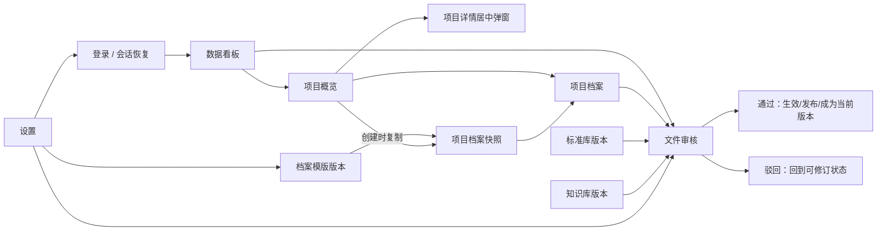
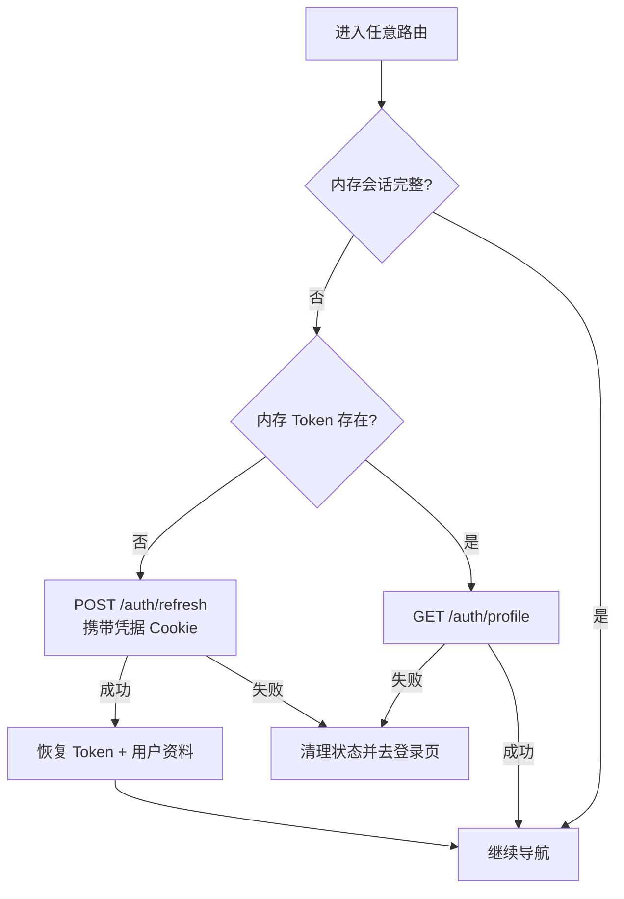
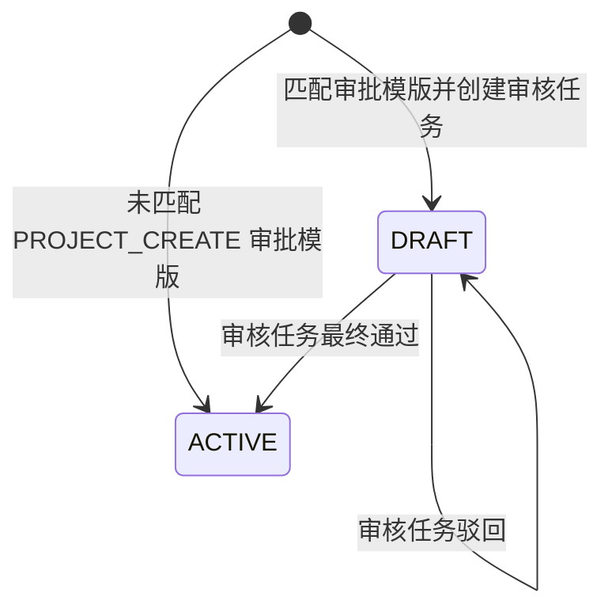
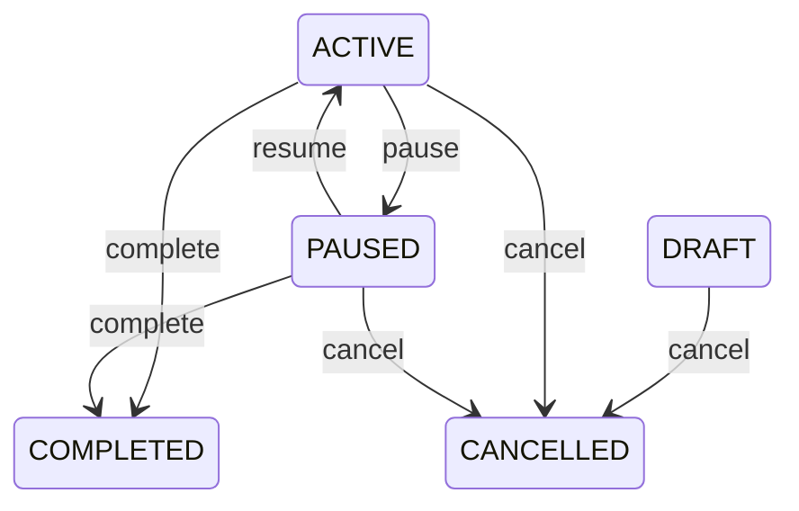
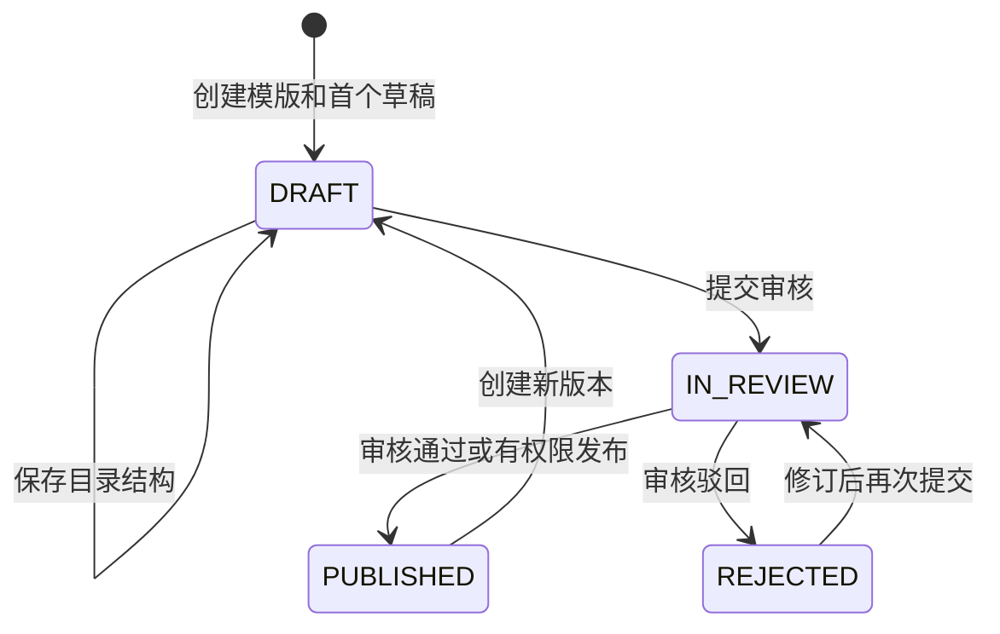
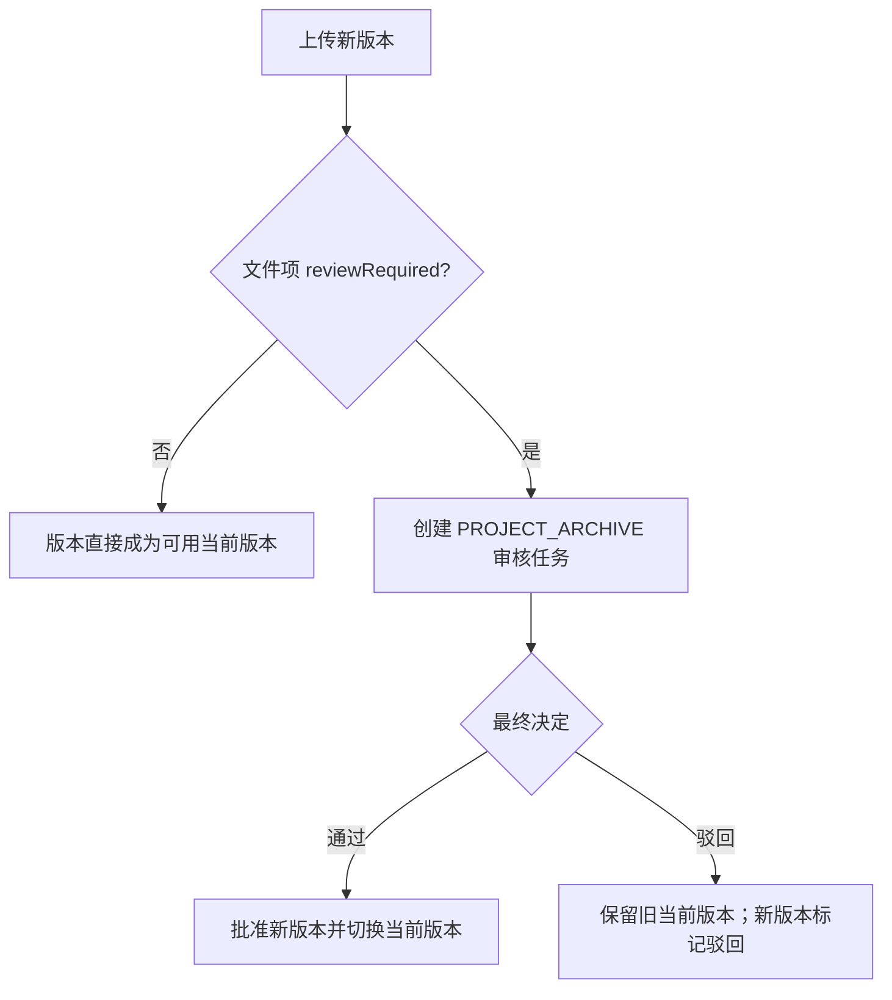

# 前端业务流程

## 文档定位

本文记录交付管理平台前端当前可执行的业务流程、页面状态、权限边界、异常分支和验收步骤。页面、路由和工程分层见 [前端页面架构](frontend-architecture.md)。

- 基线日期：2026-07-16。
- 事实来源：当前前端源码及其实际调用的后端契约。
- 本文不把未接入页面的 API 方法、待配置转换器或讨论方案写成已完成能力。
- “前端允许”只表示页面入口或按钮可见；后端权限、审核指派和数据范围校验始终是最终结论。

## 1. 全平台主流程



左侧主导航承担日常业务；右上角设置承担全局配置；项目创建/详情/编辑通过可分享深链打开同一个项目列表页上的抽屉。

## 2. 登录、刷新与退出

### 2.1 首次登录

入口：`/login`。

1. 页面以静默方式请求 `/system-config/public`，读取平台名称和登录标语；失败不阻断登录。
2. 用户可切换中文或英文，输入用户名、密码。
3. Arco 表单校验用户名 2～50 字符、密码 6～100 字符。
4. 前端调用 `POST /auth/login`。
5. 成功响应必须同时包含 Access Token 和用户资料；用户资料必须包含合法的用户 ID、角色数组和权限数组。
6. Access Token 只写入内存，用户资料写入 `userStore`。
7. 若 URL 有安全的 `redirect`，登录后回到该站内深链；否则进入 `/dashboard`。

登录失败会清空本地会话状态并显示统一登录失败提示。公开配置失败、用户名密码失败和业务页面 API 失败互不混淆。

### 2.2 页面刷新后的会话恢复



- 同一时刻多个路由导航共享 `sessionRestorePromise`，只恢复一次会话。
- 普通 API 出现并发 401 时共享另一条 `refreshPromise`，只调用一次 `/auth/refresh`，随后重放各原请求。
- 刷新失败只显示一次“登录已过期”，清空 Query 缓存和预览状态，然后回登录页。
- 访问 `/login` 时如果恢复出有效会话，会直接转到 `/dashboard`。

### 2.3 退出

1. 用户从顶栏用户菜单选择退出。
2. 前端调用 `POST /auth/logout`；即使服务端调用失败，本地清理仍继续。
3. 清除 Access Token、用户资料、全部 Query 缓存和打开中的文件预览。
4. 跳转 `/login`。

## 3. 数据看板

入口：`/dashboard`；路由权限 `dashboard:view`。

### 3.1 页面加载

页面并行加载五个独立数据源：

| 区块       | API                            | 内容                                 | 失败行为               |
| ---------- | ------------------------------ | ------------------------------------ | ---------------------- |
| 项目概览   | `/dashboard/project-summary`   | 总数、进行中、已验收、高风险         | 仅该区块显示错误和重试 |
| 我的待办   | `/dashboard/my-tasks`          | 审核、驳回修改、风险、阶段、系统通知 | 仅该区块显示错误和重试 |
| 高风险项目 | `/dashboard/high-risks`        | 当前数据范围内高风险项目             | 仅该区块显示错误和重试 |
| 近期项目   | `/dashboard/recent-projects`   | 按更新时间排列的可见项目             | 仅该区块显示错误和重试 |
| 近期活动   | `/dashboard/recent-activities` | 可见项目的脱敏活动                   | 仅该区块显示错误和重试 |

欢迎区根据用户主要角色展示不同工作提示，但角色只影响文案，不在前端扩展数据范围。

### 3.2 跳转规则

- 高风险项目、近期项目和带项目 ID 的活动进入 `/projects/:projectId`。
- 文件审核待办进入 `/review/:taskId`，同时保留审核列表的筛选和分页 query。
- 有项目 ID 的其他待办优先进入项目详情。
- 无项目 ID 的标准、知识、档案模版待办分别进入对应列表页。
- 纯系统通知没有完整通知详情页时只在看板展示。

审核页消费 path 参数并自动打开任务详情；关闭详情时回到 `/review`，原列表 query 不丢失。

## 4. 项目概览、创建、审批与详情

入口：`/projects`；路由权限 `project:view`。

### 4.1 列表与筛选

1. 页面加载 `/projects/summary` 和分页 `/projects`。
2. 四张统计卡分别筛选全部、进行中、已验收和高风险项目。
3. 关键词搜索项目名称、项目编号或客户名称。
4. `page`、`pageSize`、`keyword`、`summaryFilter`、`sort` 写入 URL query。
5. 列表展示项目名称与编号、区域、项目/合同分类、状态、阶段、进度、签约/验收时间、原币金额、折算人民币、销售和项目经理。
6. 金额字段是否返回、项目是否在列表中由后端敏感字段权限和数据范围决定；前端不自行扩展。
7. 视图选择器统一提供“我的项目”“全部项目”“归档项目”；页面默认使用 `scope=mine`，切换到 `scope=all` 只扩大查询意图，实际结果仍受后端数据范围约束。
8. 选择“归档项目”后调用 `/projects/archived`，并通过 URL 的 `view=archived` 保持可恢复的页面状态。
9. 正常列表不设置操作列；查看、编辑、进度和归档动作集中在居中详情弹窗。归档列表只提供查看、恢复和受限永久删除。
10. 视图选择、关键词搜索、刷新和创建操作位于表格附着式工具栏；统计卡、工具栏、表格和分页构成同一紧凑工作区。

动作权限：

| 动作     | 前端权限/条件                       |
| -------- | ----------------------------------- |
| 创建     | `project:create`                    |
| 编辑     | `project:update`                    |
| 进度调整 | `project:progress:update` 且项目未归档 |
| 归档     | 服务端返回 `canArchive=true` 且未归档 |
| 恢复     | `project:restore` 且已归档          |

### 4.2 创建项目

入口：`/projects/create`，在项目概览上打开 80vw 抽屉。

页面同时加载：启用国家、币种、启用语言、项目聚合配置（项目类型、合同类型、产品和项目关键词），以及销售负责人、项目经理、项目成员三类目的化用户引用。项目聚合配置由 `GET /projects/configuration` 返回，并与服务端写入终检使用同一组数据库启用字典。

表单包含：

- 基础信息：名称、简称、国家、城市、客户、项目类型、合同类型、产品、项目关键词和语言。
- 合同信息：仅 `project:view_contract` 用户可填写合同编号和签约时间。
- 金额信息：仅 `project:view_financial` 用户可填写原币种、原金额和折算币种。
- 计划信息：计划起止、初始阶段、进度、风险和风险说明。
- 预计验收：仅 `project:view_acceptance` 用户可填写。
- 团队：销售、项目经理、电气和软件负责人。

页面必须选择一个当前 `PUBLISHED` 的档案模版；新建项目审批模版由后端按国家优先、全局兜底匹配。提交使用稳定 `Idempotency-Key`，后端在同一事务中完成：

1. 生成项目编号并保存原币金额、折算金额、汇率及汇率日期。
2. 同步负责人到项目成员。
3. 校验用户所选档案模版及发布版本，复制项目快照。
4. 按国家优先、全局兜底查找启用的 `PROJECT_CREATE` 审批模版。
5. 写审计和领域事件。

若所选模版不存在、已停用或没有可用发布版本，整个创建请求失败，不留下半个项目。相同幂等键和相同请求只返回原项目；同键不同请求返回 409。

### 4.3 新建项目审批



- 前端创建成功后统一提示“项目创建成功”并关闭抽屉；项目实际状态以服务端返回和列表刷新为准。
- 有审批配置时，任务以 `PROJECT_CREATE` 来源进入文件审核中心；该任务没有文件版本，因此预览按钮禁用。
- 最终通过后项目转为 `ACTIVE`，驳回后保留 `DRAFT`。
- 草稿仍可按 `project:update` 编辑；普通编辑不会隐式创建第二个新建项目审核任务。

### 4.4 项目详情与编辑

入口：`/projects/:projectId` 打开 800px 居中详情弹窗，`/projects/:projectId/edit` 打开编辑抽屉；两者保留项目概览的筛选、分页和视图 query。

详情按权限提供：

- 基础、计划、风险、合同与金额字段。
- 项目类型、合同类型、产品、关键词以及销售、项目经理、电气和软件负责人。
- `project:progress:update`：统一调整阶段、进度百分比和预计/实际验收时间。
- 服务端返回 `canEdit`、`canUpdateProgress` 和 `canArchive` 控制弹窗顶栏动作；敏感合同和金额字段继续由后端裁剪。

编辑只更新普通字段；阶段、进度、生命周期和验收时间必须走专用命令，不能通过普通 `PATCH /projects/:id` 绕过业务校验。预计验收时间可在创建时由具备 `project:view_acceptance` 的用户填写，创建完成后与实际验收时间一起由统一进度命令维护。

所有项目写命令携带当前 `revision`。服务端检测到旧 revision 时返回 409；前端刷新项目详情/列表并提示用户基于最新数据重新操作，绝不自动重放 mutation。

### 4.5 生命周期与阶段

生命周期：



归档是独立软归档状态，不替代生命周期；有权限者可归档并恢复。

归档列表调用 `GET /projects/archived`，沿用 `scope`、关键词、分页和排序。列表展示项目名称、区域、项目类型、合同类型、归档人、归档时间和项目经理，只提供查看、恢复和永久删除；恢复后项目回到正常列表。

永久删除是受限管理动作：前端只向 `SUPER_ADMIN` 且具备 `project:delete` 的用户展示；后端只允许无文件、无审核、无财务且无既有审计记录的项目删除，否则返回 409 并记录失败审计。常规项目始终使用归档/恢复。

固定交付阶段依次为：启动、深化、采购、施工、调试、测试、内验、外验、维保。向前推进可直接确认，向后回退必须填写原因；列表快捷选择和详情弹窗都遵守该规则。

## 5. 档案模版、项目快照与同步

入口：`/archive-template`；路由权限 `archive_template:view`。

### 5.1 模版版本流程



1. `archive_template:create` 创建模版元数据和首个草稿版本。
2. `archive_template:update_draft` 可编辑 `DRAFT/REJECTED` 版本的两级结构：文件夹和文件项。
3. 文件项可配置必填、需审核、审批模版、负责人角色、多文件、扩展名、大小、命名规则和排序。
4. 保存时携带 `revision`，服务端用乐观版本阻止旧页面覆盖新修改。
5. `archive_template:submit_review` 会先保存结构，再提交统一审核并锁定草稿。
6. 最终审核通过会发布版本并更新模版的当前发布版本；前端不提供绕过统一审核的直接发布按钮。
7. `archive_template:disable` 停用模版，只影响新项目选择，不删除历史版本或项目快照。

页面提供内置标准目录集合，可一次补充到当前草稿；稳定键确保再次执行不会重复同一目录。

### 5.2 项目创建时复制快照

项目创建只能使用模版的当前 `PUBLISHED` 版本。后端复制文件夹和文件项到项目专属快照，项目随后不再实时读取模版结构，因此：

- 模版后续改名或修改规则不会覆盖项目已有目录。
- 模版停用不会破坏已经创建的项目。
- 项目临时项不会反向写入模版。

### 5.3 项目同步模版新增项

入口：项目档案页“同步模板”；权限 `archive:template:sync`。

1. 前端请求 `/projects/:id/archive-template-diff`。
2. 差异按“新增文件夹/文件项”“已有键字段变化”“项目独有内容”分组展示。
3. 只有 `canSync=true` 时允许确认。
4. 前端只提交新增项稳定键和 `confirmAdditions=true`。
5. 服务端执行 `ADD_ONLY`：只新增，不重命名、不覆盖、不归档、不删除项目现有内容。
6. 同步后刷新项目档案树和差异。

当差异要求迁移或没有可同步新增项时，页面只展示原因，不伪造同步成功。

## 6. 项目档案上传与审核

入口：`/archive`；路由权限 `archive:view`。

### 6.1 选择项目与加载目录

1. 加载当前用户可见的项目选项。
2. 优先使用 URL 的 `projectId`；无有效选择时自动选择第一项并回写 URL。
3. 请求 `/projects/:id/archive-tree`。
4. 显示总文件项、已完成、必填完成和完成率，并展开所有未归档文件夹。
5. 每个文件项的上传、归档、恢复能力直接使用后端返回的 `canUpload/canArchive/canRestore`。

### 6.2 临时档案项

权限：`archive:item:create_temporary`。

用户必须选择文件夹、填写名称和创建原因、选择负责人；可配置必填、需审核、建议纳入模版、多文件和允许扩展名。创建结果只属于当前项目，不修改源模版。

### 6.3 上传文件版本

1. 用户在文件项上选择上传。
2. 无当前文件时默认 `REPLACE`；已有当前文件时默认 `NEW_VERSION`。
3. 用户选择小修订或大修订，可填写变更说明。
4. 允许多文件的档案项可选择“创建为新逻辑文件”，否则沿用当前逻辑文件形成新版本。
5. 前端发送 multipart、上传进度和 `Idempotency-Key`，超时 120 秒。
6. 成功后刷新项目档案树。

同一个文件对象和相同操作在失败重试时复用幂等键；成功后才释放，防止网络抖动生成重复版本。

命名与首传规则：

- `项目立项资料-{version}` 接受 `项目立项资料-V1.0.pdf`；`{version}` 可匹配带或不带 `V` 的数字版本，模板不含扩展名时按 basename 校验。
- `allowMultipleFiles=false` 仍允许第一次创建 LogicalFile，只阻止第二个独立文件；后续上传沿用当前 LogicalFile。
- 命名、扩展名、大小或文件头不符合要求时在写 MinIO 前返回明确错误；数据库事务失败时服务端清理未提交对象。

### 6.4 审核分支



- 审核中的文件项完整显示在档案树中。
- 普通成员若 `canPreview=false`，点击时会得到权限提示；上传人、当前审核人、管理员或具备待审预览权限者由后端授予预览会话。
- 档案项归档只做软归档，文件和历史版本仍保留；具备恢复能力时可恢复。

## 7. 统一文件只读预览

入口来自档案、审核、标准和知识页面，全局只打开一个预览弹窗。

### 7.1 会话流程

1. 页面传入逻辑文件 ID 或文件版本 ID 和标题。
2. `FilePreviewRouter` 请求 `GET /files/:id/preview-session`。
3. 后端完成文件权限、待审可见性和下载权限判断，返回短期签名内容 URL、Viewer 类型和处理状态。
4. 前端只在 `availability.state=READY` 时加载具体 Viewer。
5. 下载按钮只在 `downloadAllowed=true` 时出现，下载再次调用受控 `/files/:id/download`。

### 7.2 Viewer 行为

| 文件                  | 当前预览行为                                                                          |
| --------------------- | ------------------------------------------------------------------------------------- |
| Word/Excel/PowerPoint | Docs URL 与 JWT Secret 完整配置后创建 ONLYOFFICE 签名只读会话；配置不完整时明确不可用 |
| PDF                   | PDF.js；最多渲染前 80 页                                                              |
| 普通图片              | Viewer.js 查看、缩放、旋转                                                            |
| 大图                  | 完成大图处理后由 OpenSeadragon 查看                                                   |
| Markdown              | 转义原始 HTML，安全渲染标题、列表、表格、代码和受限链接                               |
| CAD/Visio             | 完成外部转换后按 PDF 预览                                                             |
| XMind                 | 完成安全解析后显示工作表大纲                                                          |
| 视频                  | 完成转码后用浏览器原生播放器                                                          |
| 音频                  | 浏览器原生播放器                                                                      |
| 其他                  | 明确提示不支持；有下载权限时可下载                                                    |

Office 全平台固定只读，前端没有编辑模式、编辑按钮或保存回调。

### 7.3 处理中与失败

- `PROCESSING`：提示预览产物正在生成。
- `UNAVAILABLE`：展示后端安全原因；转换器未配置以 `FILE_CONVERTER_NOT_CONFIGURED` 明确失败，不回退为假预览。
- 会话请求失败：显示页级错误、重试和下载原文件入口。
- 当前组件不自动轮询处理状态；重新打开或点击重试才会获取最新状态。

## 8. 文件审核中心

入口：`/review`；所有已登录用户可进入，数据由后端按本人相关任务或查看全部权限过滤。

### 8.1 列表与详情

页面加载：

- 汇总：待我审核、全部待审核、今日新增、已超时。
- 分页列表：关键词、状态、页码、每页数量写入 URL。
- 详情：任务基本信息、来源、文件版本、步骤、指派人、意见和历史事件。

审核来源包括：项目创建、项目档案、档案模版、标准库、知识库。只有带文件版本的任务可预览。

### 8.2 谁能执行审核

前端同时要求：

1. 任务状态是 `PENDING`。
2. 当前用户是当前 `ACTIVE` 步骤中状态为 `PENDING` 的指派人。
3. 用户具备 `file_review:act`，或角色为 `SUPER_ADMIN`。

后端会再次校验指派关系、自审限制、项目数据范围和任务状态，前端条件不能替代服务端校验。

### 8.3 通过与驳回

1. 用户打开审核弹窗。
2. 通过意见可选；驳回意见必填，最多 2000 字。
3. 通过只完成当前指派；系统按单人、全员会签、多人会签、串行或并行配置决定是否进入下一步。
4. 驳回终止当前任务并调用对应业务适配器。
5. 成功后失效审核列表、汇总、详情和历史 Query。

服务端以 `activeReviewKey` 唯一约束防止同一业务版本出现两个活动任务，并通过行锁和条件更新领取审核动作。多人同时提交时只有满足条件的动作成功，终态与业务回写只执行一次，后来请求得到 409 后刷新详情。

最终业务回写：

| 来源     | 通过                       | 驳回                       |
| -------- | -------------------------- | -------------------------- |
| 项目创建 | 项目转 `ACTIVE`            | 项目保持 `DRAFT`           |
| 项目档案 | 新版本批准并成为当前版本   | 新版本驳回，旧当前版本不变 |
| 档案模版 | 版本发布并设为当前发布版本 | 版本转 `REJECTED`          |
| 标准库   | 版本发布并设为当前发布版本 | 版本转 `REJECTED`          |
| 知识库   | 版本发布并设为当前发布版本 | 版本转 `REJECTED`          |

## 9. 标准库

入口：`/standards`；路由权限 `standard:view`。

### 9.1 列表与权限

页面显示标准总数、待审核、已发布和已归档，支持关键词、状态和分页。动作权限：

| 动作                 | 权限                     |
| -------------------- | ------------------------ |
| 新增标准             | `standard:create`        |
| 编辑主数据/草稿/关系 | `standard:update_draft`  |
| 提交审核             | `standard:submit_review` |
| 下载文件             | `standard:download`      |
| 归档                 | `standard:archive`       |

### 9.2 创建与版本

1. 新增时填写标准编号、名称、类型、分类、生效日期和首版变更说明。
2. 内容可选择在线结构化内容或文件。
3. 文件模式先通过 `/files/drafts` 上传 DRAFT 文件版本，再创建标准；上传使用幂等键。
4. 标准主数据与标准版本分离；已发布标准再修改时创建新草稿版本。
5. `DRAFT/REJECTED` 版本可按 `revision` 编辑；同一标准存在 `DRAFT/IN_REVIEW` 时前端不再创建另一个活动草稿。
6. 提交统一审核后转 `IN_REVIEW`；最终通过发布并替换当前发布版本，驳回后可继续修订。
7. 历史版本保留，可预览/下载文件或在详情中查看在线内容。

### 9.3 标准关系与归档

有编辑权限者可建立或删除六种标准到标准关系：配套表单、配套模版、引用、替代、前置条件、后续标准。关系候选排除自身和已归档标准。

归档使用软归档；审核中的标准不能从当前页面执行归档。

## 10. 知识库

入口：`/knowledge`；路由权限 `knowledge:view`。

### 10.1 列表与权限

页面显示资料总数、待审核、已发布和本月新增，支持关键词、知识分类、内容形式、状态和分页。知识分类由 `/knowledge/categories` 只读加载为树形选项，当前页面不维护分类。

动作权限：`knowledge:create`、`knowledge:update_draft`、`knowledge:submit_review`、`knowledge:download`、`knowledge:archive`。

### 10.2 三类内容

| 内容形式 | 创建要求               | 查看行为                               |
| -------- | ---------------------- | -------------------------------------- |
| 文件     | 必须选择文件           | 统一文件预览或受控下载                 |
| Markdown | 必须填写正文           | 详情中只读显示 Markdown 内容           |
| 外部链接 | 必须是完整 HTTP(S) URL | 新窗口打开并使用 `noopener,noreferrer` |

每个版本还可附加多个支持文件；支持文件同样走统一 DRAFT 上传、预览和下载。

### 10.3 版本与审核

1. 创建知识主数据和首个草稿版本。
2. `DRAFT/REJECTED` 可修改；已发布资料创建新草稿版本。
3. 文件、Markdown、链接之间可以在新版本中切换。
4. 提交统一审核后转 `IN_REVIEW`。
5. 最终通过发布并更新当前发布版本；驳回后可继续修订。
6. 审核中不能从当前页面归档；归档保留历史版本。

文件和支持文件先上传、后创建知识条目；若后续创建失败，已上传的 DRAFT 文件保持可复用状态，用户可沿用原文件重试或主动归档，系统不会在业务记录尚未创建时自动物理删除文件。标准文件创建也有相同的“文件先于业务记录”边界。

## 11. 工具中心

入口：`/tools`；路由权限 `tools:view`。

1. 普通用户只请求启用工具；`tools:manage` 用户请求时包含停用工具。
2. 页面按后端工具分类生成左侧目录，`category` 写入 URL。
3. 内部工具的入口必须以 `/` 开头，通过 Router 打开。
4. 外部工具必须是 HTTP(S) 地址，在新窗口以 `noopener,noreferrer` 打开。
5. 没有入口、已停用或地址无效时不执行跳转并显示原因。
6. `tools:manage` 可新增、编辑、启用、停用和维护 JSON 对象配置。

工具中心只负责目录和入口，不把任意内部路由自动变成已实现工具页；配置不存在的站内路径会进入 404。

## 12. 六类设置流程

所有设置都从顶栏齿轮进入。路由权限使用“查看或管理”任一满足；没有管理权限时页面保持只读或禁用动作。

### 12.1 币种与汇率

入口 `/settings/currency`；管理权限 `currency:manage`。

- 加载币种、兑人民币汇率、日期、来源和锁定状态。
- 管理者可新增币种、编辑名称/符号/小数位、维护未锁定汇率、同步在线汇率、锁定/解锁和停用。
- 新币种代码必须是 3～10 位大写字母。
- 停用只阻止新项目选择，历史项目金额快照不变。
- 页面明确说明项目保存独立汇率快照，而不是动态回算历史金额。

### 12.2 通知规则

入口 `/settings/notifications`；管理权限 `notification_rule:manage`。

- 按规则名或事件类型本地筛选。
- 管理者可维护规则名称、事件类型、站内/飞书/企业微信渠道、接收策略、模版 ID 和启用状态。
- 接收策略支持业务负责人、项目成员、指定角色、指定用户；指定角色/用户必须至少有一个值。
- 删除前确认；是否物理删除或保留历史由后端按已有发送记录决定。
- 页面不保存渠道 Secret，渠道凭据在接口集成中维护。

### 12.3 审批配置

入口 `/settings/approvals`；管理权限 `approval_config:manage`。

- 支持关键词和分页。
- 业务类型固定为：新建项目、项目档案、标准库、知识库、档案模版。
- 每个模版至少一个有名称、有审批对象的步骤。
- 审批对象可按角色编码或用户 ID 配置；页面按顺序重排 `stepOrder`。
- 管理者可新增、编辑、启停、删除。
- 配置页只生成规则；实际处理都在文件审核中心完成。

### 12.4 操作日志

入口 `/settings/logs`；权限 `audit_log:view`，只读。

- 按关键词、操作类型和时间范围查询，筛选写入 URL。
- 列表显示时间、用户、模块、动作、对象、结果、IP 和来源。
- 详情抽屉显示 Trace ID、错误原因、变更前和变更后数据。
- 前端对密码、Secret、Token、Key、Authorization 再次脱敏；后端仍不得返回明文秘密。

### 12.5 系统配置

入口 `/settings/system`；管理权限 `system_setting:manage`。

- 分段维护项目默认分页/风险/自动档案、附件大小、文件扩展名、审批超时、知识分页、会话时长和登录失败上限。
- 上传扩展名会去点号、转小写、去重并校验字母数字，至少保留一项。
- 服务器时间、时区和 UTC 偏移只读，单独刷新。
- 无管理权限时整个表单禁用；保存成功更新 Query 缓存。

### 12.6 接口集成

入口 `/settings/integrations`；管理权限 `integration:manage`。

- 当前只展示飞书和企业微信。
- 管理者可配置身份凭据、通讯录部门、测试接收人、启用状态，并执行连接测试、通讯录同步和测试通知。
- 启用前必须满足对应服务商的必要身份字段。
- 已保存 Secret 只显示 `******` 状态，编辑表单不回填；留空表示不替换。
- 查看权限用户仍可查看配置状态和同步日志，但不能修改、测试或同步。
- 同步日志按服务商分页，统计和错误内容再次脱敏。
- 后端使用租约和 revision 阻止同一服务商并发同步；匹配结果写入统一用户及 `ExternalIdentity`，冲突与未匹配项进入脱敏同步日志。
- 领域事件由独立 Outbox Worker 按通知规则投递站内、飞书或企业微信；每个事件/用户/通道写 `NotificationDelivery` 回执并按幂等键去重，页面不把“已排队”展示为“外部发送成功”。

## 13. 隐藏组织与权限流程

这三页仅支持深链，不进入任何菜单：

| 页面                        | 流程                                                     | 当前前端边界                                     |
| --------------------------- | -------------------------------------------------------- | ------------------------------------------------ |
| `/organization/departments` | 查看部门树、新建根/子部门、编辑负责人和排序              | 路由 `department:view`；维护按钮 `department:manage` |
| `/organization/users`       | 用户查询、新增/编辑、角色分配、重置密码、启用/禁用、删除 | 路由 `user:view`；按钮分别使用对应 `user:*` 权限 |
| `/organization/roles`       | 角色查询、新增/编辑/删除、权限矩阵分配                   | 路由 `role:view`；按钮分别使用对应 `role:*` 权限 |

这些页面已接入 TanStack Query 和动作级前端权限；前端只改善可用性，后端仍必须拒绝未授权维护请求并审计敏感变更。

## 14. 主题与语言流程

### 14.1 主题

1. 顶栏选择浅色、深色或跟随系统。
2. 选择值写入 `delivery-platform:theme`。
3. 深色模式设置 `body[arco-theme=dark]`；系统模式监听 `prefers-color-scheme`。
4. 刷新页面后恢复选择。

当前基础壳和 Arco 主题会切换，但仍需逐页验证固定浅色样式、图表、预览器和弹窗的对比度。

### 14.2 语言

1. 登录页或顶栏选择中文/English。
2. 写入 `lang`，同步 Vue i18n 和 Arco locale。
3. 导航、设置菜单、路由标题、浏览器标题和登录页文案立即更新。

主导航、六类设置和核心业务流程的固定文案已接入同构中英文 key；业务数据不自动翻译。仅深链组织权限维护页仍以中文为主。

## 15. 异常、权限与数据范围

### 15.1 异常处理矩阵

| 场景                  | 请求层行为                      | 页面行为                                   |
| --------------------- | ------------------------------- | ------------------------------------------ |
| Access Token 过期     | 单飞刷新并重放请求              | 无感继续；刷新失败回登录                   |
| 403                   | 提示没有操作权限                | 保留当前页；动作失败不伪造成功             |
| 404                   | 提示资源不存在                  | 详情页显示加载失败或空详情                 |
| 409                   | 不自动重试                      | 项目编辑/阶段/状态/验收自动刷新最新 revision 并提示；幂等键冲突要求核对原请求 |
| 422                   | 展示后端校验消息                | 表单保留，用户修正后再提交                 |
| 429                   | 提示稍后重试                    | mutation 不自动重放                        |
| 500/超时/断网         | 统一错误提示                    | 查询区块可重试；提交保留当前输入           |
| 文件处理中            | 返回 `PROCESSING`               | 明确提示并允许稍后重试                     |
| 转换器未配置/任务失败 | 返回 `UNAVAILABLE` 和安全错误码 | 不冒充成功预览；有权限时允许下载           |

### 15.2 页面与动作权限

| 领域     | 页面权限                  | 主要动作权限                                                        |
| -------- | ------------------------- | ------------------------------------------------------------------- |
| 项目     | `project:view`            | create/update/stage/update acceptance/manage member/archive/restore |
| 档案     | `archive:view`            | 临时项与同步用明确权限；行操作使用后端 `can*`                       |
| 审核     | 登录即可进入              | `file_review:act` + 当前步骤指派                                    |
| 档案模版 | `archive_template:view`   | create/update_draft/submit_review/publish/disable                   |
| 标准     | `standard:view`           | create/update_draft/submit_review/download/archive                  |
| 知识     | `knowledge:view`          | create/update_draft/submit_review/download/archive                  |
| 工具     | `tools:view`              | `tools:manage`                                                      |
| 设置     | 各 `*:view` 或 `*:manage` | 各 `*:manage`；操作日志只读                                         |

### 15.3 数据范围

- 看板、项目列表、项目详情和档案项目选项均使用后端过滤后的项目范围。
- 负责人选项通过 `/references/users?purpose=...` 获取，不调用全量用户列表。
- 审核中心由后端决定本人相关、本人待审或可查看全部的任务。
- 待审文件预览、原文件下载和版本列表都再次经过文件服务权限判断。
- 标准、知识和设置是平台级资源，仍由相应后端权限控制。
- 前端不得通过隐藏列、客户端筛选或缓存全量响应实现数据范围。

### 15.4 敏感操作

合同/金额查看、文件下载、审核决定、成员与权限变更、密码重置、汇率变更、系统设置、集成凭据和同步操作都必须由后端写必要审计。前端日志详情中的脱敏只是第二层展示保护。

## 16. 可执行验收基线

### 16.1 自动检查

在仓库根目录执行：

```powershell
pnpm --dir delivery-platform-web type-check
pnpm --dir delivery-platform-web test
pnpm --dir delivery-platform-web build
pnpm --dir delivery-platform-server type-check
pnpm --dir delivery-platform-server test
docker compose --env-file .env.example -f docker-compose.yml config -q
docker compose --env-file .env.example -f docker-compose.yml -f docker-compose.prod.yml config -q
```

### 16.2 浏览器环境

UI 冒烟可在构建后启动本地模拟服务：

```powershell
$env:LOCAL_TEST_ADMIN_PASSWORD = Read-Host '请输入本地模拟管理员密码'
$env:LOCAL_TEST_PM_PASSWORD = Read-Host '请输入本地模拟项目经理密码'
node scripts/local-test-server.mjs
```

默认地址为 `http://127.0.0.1:18080`。模拟服务只用于页面渲染和基本交互；角色、数据范围、真实刷新 Cookie、MinIO 和审核事务必须在 Docker Compose 真实后端环境验证，不能用模拟结果代替。

### 16.3 场景清单

| ID        | 前置条件                                                                        | 执行步骤                                                                | 通过标准                                                                                   |
| --------- | ------------------------------------------------------------------------------- | ----------------------------------------------------------------------- | ------------------------------------------------------------------------------------------ |
| AUTH-01   | 有效账号、可用刷新会话                                                          | 登录深链；刷新页面；制造多个并发 401；退出                              | 回原深链；只刷新一次；退出后 Query 和预览清空                                              |
| NAV-01    | 分别准备普通用户、设置只读用户、`SUPER_ADMIN`                                   | 登录并检查侧栏、齿轮、深链、无权限路由                                  | 只显示可访问菜单；无权限路由回退；超级管理员可见全部当前路由                               |
| DASH-01   | 账号有 `dashboard:view` 且有项目/审核/风险数据                                  | 打开看板，分别让一个区块失败，点击项目和待办                            | 其他区块仍显示；项目进入详情；错误区块可独立重试                                           |
| PROJ-01   | 有发布档案模版；分别启用/停用新建项目审批                                       | 创建项目两次                                                            | 无审批时返回 `ACTIVE`；有审批时返回 `DRAFT` 并生成 `PROJECT_CREATE` 任务；两者都有档案快照 |
| PROJ-02   | `project:update`、`project:progress:update`、成员/回款权限分别准备              | 编辑普通字段；通过统一进度命令前推/回退阶段并更新验收；管理成员和回款；执行生命周期命令 | 专用命令生效；阶段回退无原因被阻止；相关 Query 刷新                                        |
| PROJ-03   | 超级管理员、一个有关联项目和一个隔离无关联测试项目                              | 打开永久删除二次核验；分别请求删除                                      | 有关联项目返回含四类计数的 409 并保留页面/失败审计；无关联项目删除且保留成功审计            |
| ATPL-01   | 有档案模版维护与审核账号                                                        | 建模版、编辑结构、提交、驳回、修订、通过、创建新版本、停用              | 状态按 DRAFT/IN_REVIEW/REJECTED/PUBLISHED 变化；发布版只读；历史保留                       |
| ARCH-01   | 已创建带快照项目，源模版发布了新增项                                            | 打开项目档案并同步                                                      | 只新增选中稳定键；已有目录、文件和项目独有项不被覆盖或删除                                 |
| ARCH-02   | 一个免审文件项和一个需审文件项                                                  | 按 `{version}` 命名首传；重复同一请求；审核通过/驳回；再上传；归档/恢复 | 首传可用且幂等不重复；免审立即可用；审核只在通过后切换当前版本；旧版保留                    |
| FILE-01   | 准备 Office、PDF、图片、大图、Markdown、CAD、Visio、XMind、视频、音频和未知格式 | 从至少两个业务页面分别预览；检查下载权限                                | 全部只读；READY 使用正确 Viewer；处理中/未配置显式提示；无下载权限不显示按钮               |
| REVIEW-01 | 当前审核人、非当前审核人、查看全部账号各一                                      | 查看列表和详情；通过当前步骤；驳回另一任务                              | 只有当前指派且有权限者能操作；驳回必须填意见；业务状态正确回写                             |
| STD-01    | 标准维护、审核、只读账号                                                        | 创建在线/文件标准；建立关系；提交；通过/驳回；新版本；归档              | 版本历史、当前发布指针、文件状态和权限均正确                                               |
| KNOW-01   | 知识维护、审核、只读账号                                                        | 创建文件/Markdown/链接和支持文件；提交；通过/驳回；新版本；归档         | 三类内容按各自方式查看；支持文件可预览/下载；当前发布版本正确                              |
| TOOL-01   | 普通用户与 `tools:manage` 用户                                                  | 查看目录；打开内外工具；创建、编辑、启停；填写非法 URL/JSON             | 普通用户不见停用项；地址和 JSON 校验有效；外链安全打开                                     |
| SET-01    | 每类设置各准备 view-only 与 manage 账号                                         | 逐页执行查看与修改；检查日志和 Secret                                   | 只读账号不能修改；管理账号按权限成功；Secret 不回显；敏感修改有审计                        |
| UI-01     | 中文/英文、浅色/深色/系统模式                                                   | 切换后刷新；在 1440px、900px、600px 宽度检查关键页                      | 偏好恢复；壳层语言正确；侧栏响应式；关键表格/抽屉可操作                                    |
| SCOPE-01  | 两个项目范围不重叠的账号                                                        | 比较看板、项目、档案、审核、文件预览和下载                              | 响应只含各自范围；猜测他人 ID 得到 403/404，不泄露元数据                                   |

### 16.4 运行边界回归标记

以下边界必须保持显式，不能被页面伪装成成功：

1. 新建项目审批驳回后项目保持 `DRAFT`；普通编辑不等于重新提交审核。
2. 文件处理状态不做无限自动轮询；重试/重开获取最新状态，Worker 失败必须保留稳定错误码。
3. 深色模式需要在真实浏览器逐页检查对比度；深链组织权限页当前以中文为主。
4. 真实权限、数据范围、MinIO 文件、审核并发和通知回执只能在真实 NestJS 环境验收，模拟服务不能替代。

## 17. 流程维护规则

1. 业务状态、权限码、审核来源或 API 路径变化时，必须更新对应流程和验收 ID。
2. 新增跨模块跳转时，同时更新看板跳转、路由深链和权限回退说明。
3. 文件类型、转换任务、Viewer 或下载权限变化时，同时更新第 7 节和 `FILE-01`。
4. 设置项变化时，同步更新路由、只读/管理权限和审计要求。
5. 不再运行的页面或业务流必须从本文删除，不以“历史兼容”名义继续作为当前事实。
