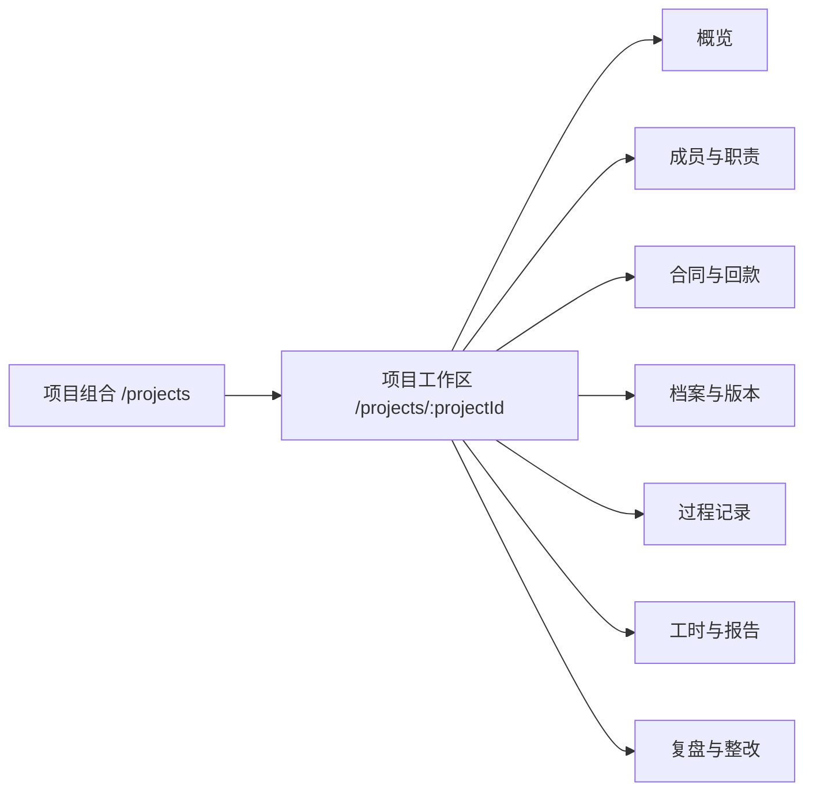
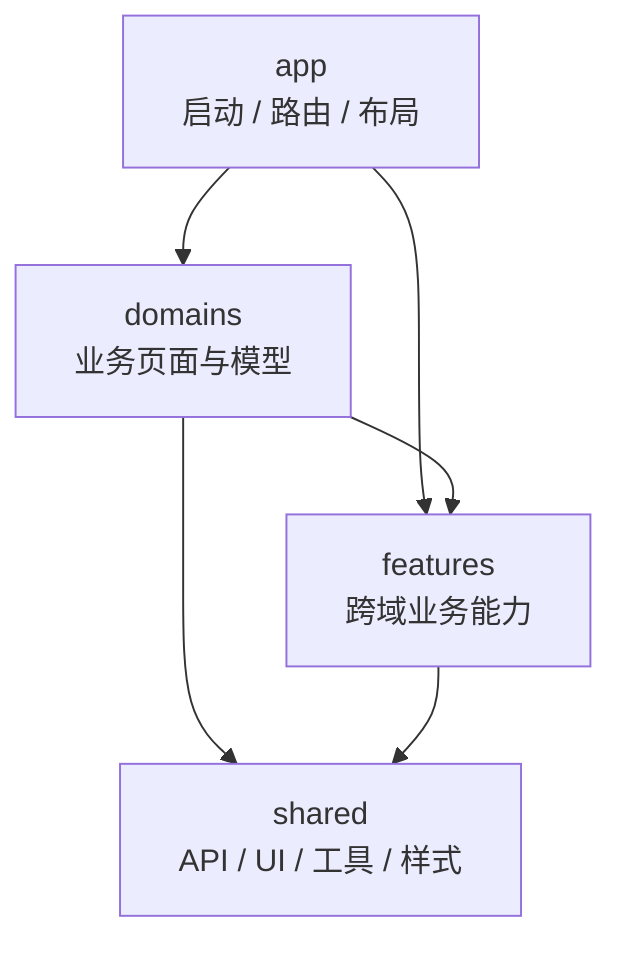

# 前端整体重构评审稿

## 文档定位

本文是用于产品、业务、设计、前端、后端、安全、测试和运维共同讨论的**候选方案**。本文所有目标路由、目录和组件均标记为“拟议”，在决策通过并落地前，不代表当前系统行为。

讨论事实基线：

- [前端页面架构](frontend-architecture.md)
- [前端业务流程](frontend-business-flows.md)
- [产品说明](product.md)
- [技术架构](architecture.md)
- [界面体验与 Arco Design 规范](ui-ux.md)

## 1. 重构要解决的核心问题

本轮不应只做视觉换皮。当前问题同时存在于产品入口、页面层级、流程状态、权限、公共能力和工程边界：

1. 菜单、路由、标题、翻译、说明和权限分散维护。
2. 项目相关能力被拆成多个全局页面，缺少以项目为上下文的连续工作区。
3. 文件审核和通用审批分成两套中心，知识库和文档模板又各自内嵌审批。
4. `file` 与 `attachment` 两套前端模型和两套预览渲染能力重叠。
5. 按钮级权限没有形成可验证的统一方案。
6. 知识库、文档模板存在快速新增和详情页创建两套分叉路径。
7. 多个大型 SFC 同时承担查询、表格、表单、审批、上传和预览。
8. 页面状态、错误、空态、分页、选项加载和数据刷新重复实现。
9. Arco 兼容层、全局样式和旧组件属性仍是运行时基础。
10. 国际化、配置化状态、业务字典和硬编码常量的边界不清。
11. 现有测试偏工具函数和源码字符串断言，无法保护关键交互。
12. 部分“前端看似可用”的路径会因动作权限或后端角色门槛在运行时中断。

## 2. 目标原则

| 原则         | 目标                                                         |
| ------------ | ------------------------------------------------------------ |
| 业务连续     | 用户围绕“任务”或“项目”完成操作，减少在全局菜单间往返         |
| 单一事实源   | 路由、菜单、权限、标题、面包屑和翻译键由一份类型化元数据生成 |
| 状态可解释   | 每个流程明确前置条件、状态迁移、下一动作、失败恢复和责任人   |
| 权限分层     | 菜单、路由、动作、数据范围、后端鉴权分别可见且可测试         |
| 领域内聚     | 页面、查询、组件、API、类型和测试按业务域组织                |
| 公共能力收敛 | 文件、审批、查询表格、错误态、字典和格式化只维护一套         |
| 渐进迁移     | 新旧模块可以短期共存，每一阶段都能单独回滚                   |
| 可验证       | 每个重构阶段绑定流程 ID、权限角色、浏览器场景和自动化测试    |

## 3. 候选信息架构

建议保留六个一级领域，但把“项目交付”改为项目工作区，把所有审批收敛为任务中心。最终名称仍需产品确认。

| 候选一级导航 | 候选二级入口                                         | 关键变化                                         |
| ------------ | ---------------------------------------------------- | ------------------------------------------------ |
| 工作中心     | 我的概览、我的任务、通知                             | 合并待办、审批、通知入口                         |
| 项目交付     | 项目组合、项目工作区                                 | 档案、成员、回款、记录、报告、复盘进入项目上下文 |
| 标准与知识   | 交付流程、检查标准、档案模板、文档模板、知识库、工具 | 保留标准资产域，统一创建/发布流程                |
| 人员与绩效   | 目标绩效、技能矩阵、培训                             | 培训归属需在此与“标准与知识”之间决策             |
| 组织与访问   | 组织、用户、角色权限                                 | 统一人员、岗位、角色和权限模型                   |
| 平台配置     | 国家语言、币种汇率、审批、通知、日志、存储、集成     | 只面向平台运营和管理员                           |

### 3.1 候选项目工作区



这样可以让项目选择只发生一次，并把项目数据范围、责任人和阶段作为工作区共同上下文。是否把文件审核作为工作区页签，还是统一放在工作中心，需要与“全局审核人跨项目处理”场景一起决定。

### 3.2 候选路由模型

以下只是讨论用示例：

```text
/work
  /work/overview
  /work/tasks
  /work/notifications

/projects
  /projects/new
  /projects/:projectId
    /projects/:projectId/overview
    /projects/:projectId/team
    /projects/:projectId/payments
    /projects/:projectId/archive
    /projects/:projectId/records
    /projects/:projectId/reports
    /projects/:projectId/retrospective

/standards
  /standards/workflows
  /standards/checklists
  /standards/archive-templates
  /standards/document-templates
  /standards/knowledge
  /standards/tools

/people
  /people/objectives
  /people/skills
  /people/training

/access
  /access/departments
  /access/users
  /access/roles

/settings
  /settings/localization
  /settings/currencies
  /settings/approvals
  /settings/notifications
  /settings/audit
  /settings/storage
  /settings/integrations
```

## 4. 候选前端工程结构

建议采用“应用壳 + 业务域 + 跨域能力 + 共享基础”的结构。是否引入服务端状态库由决策项 FR-D07 决定。

```text
src/
  app/
    bootstrap/
    router/
    layouts/
    providers/
  domains/
    project/
      pages/
      components/
      queries/
      api/
      model/
      routes.ts
      tests/
    archive/
    report/
    standards/
    knowledge/
    performance/
    organization/
    system/
  features/
    approvals/
    file-preview/
    file-upload/
    permissions/
    notifications/
  shared/
    api/
    ui/
    forms/
    tables/
    dictionaries/
    formatters/
    i18n/
    testing/
    styles/
```

### 4.1 目标依赖方向



约束建议：

- `shared` 不依赖 `domains`。
- 领域之间不通过相对路径直接引用页面内部组件。
- 跨领域复用先提升到 `features` 或 `shared`，例如审核弹窗和文件预览。
- API、DTO 和状态转换放在领域边界，页面不直接拼装重复请求参数。
- Pinia 只持有会话和客户端全局状态；服务端实体状态使用统一查询层。

## 5. 候选路由元数据

建议每个页面只声明一次：

```ts
interface AppRouteMeta {
  titleKey: string;
  descriptionKey?: string;
  icon?: string;
  menuGroup?: string;
  hidden?: boolean;
  breadcrumb?: Array<{ titleKey: string; to?: string }>;
  access?: {
    anyOf?: string[];
    allOf?: string[];
    roles?: string[];
  };
  projectContext?: boolean;
  keepAlive?: boolean;
}
```

由该声明生成或校验：

- Router；
- 侧栏和项目工作区页签；
- 页头标题、描述和面包屑；
- 权限过滤；
- 文档路由清单；
- 路由一致性测试。

## 6. 候选公共能力

### 6.1 查询与页面状态

统一列表查询契约：

- 查询参数与 URL 同步；
- 分页、排序、筛选、loading、empty、error、retry 统一；
- 请求可取消、可去重、有缓存失效策略；
- 从详情返回列表时恢复筛选和滚动；
- 字典和基础选项单独缓存；
- 错误展示由请求层和页面层明确分工，避免重复 Toast。

### 6.2 权限

建议同时支持：

- 路由级 `anyOf/allOf/roles`；
- `Can` 组件或 `v-can` 指令；
- 页面 Action 定义，统一控制显示、禁用原因和二次确认；
- 权限测试从角色种子生成覆盖矩阵；
- 后端继续执行最终鉴权和项目数据范围校验。

无权动作默认不显示还是显示禁用，需要按业务可发现性统一决策，不能由每页自行决定。

### 6.3 文件与预览

建议形成一个文件领域模型：

```text
FileResource
  id
  ownerType / ownerId / projectId
  version
  status
  permissions
  previewRoute
  downloadPolicy
  auditPolicy
```

预览层拆为：

1. 预览会话；
2. 格式路由；
3. PDF、图片、Office、Markdown、媒体等 viewer 插件；
4. 统一降级与错误态；
5. 下载与审计；
6. 可选编辑模式。

`file` 与 `attachment` 是否在后端也合并，需要单独评估数据迁移；前端可以先用适配器统一。

当前 `AttachmentPreviewPane` 会用 `v-html` 渲染后端返回的预览 HTML。重构必须把“后端 HTML 清洗与可信来源、允许的标签/属性、CSP、前端渲染方式”定义为显式安全契约，并用恶意 HTML 用例验证；不能把后端返回值默认视为可信内容。

### 6.4 审批

建议建立统一 Approval Workspace：

- 我的待办；
- 审批详情；
- 业务内容适配器；
- 文件新旧版本对比；
- 审批历史；
- 通过/驳回/转交/撤回等动作；
- 审批模板配置。

文件审核是否完全迁入通用审批模型，需要确认现有文件版本切换、审核人规则和审计要求。

### 6.5 UI 与样式

建议以原生 Arco 为基础建立少量受控封装：

- `PageShell`；
- `QueryBar`；
- `DataTable`；
- `FormDialog`；
- `DetailDrawer`；
- `StatusBadge`；
- `Can`；
- `AsyncState`。

兼容层退出应有可测量条件：旧属性调用数、`@ts-nocheck`、全局内部类覆盖和旧图标别名逐阶段归零。

## 7. 必须讨论的决策清单

| 决策 ID | 议题                            | 推荐起点                    | 需要确认                                                    | 主要影响               |
| ------- | ------------------------------- | --------------------------- | ----------------------------------------------------------- | ---------------------- |
| FR-D01  | 项目能力是否进入项目工作区      | 是                          | 全局跨项目操作保留哪些入口                                  | 项目、档案、报告、复盘 |
| FR-D02  | 文件审核与通用审批是否统一      | 统一 UI，后端可先适配       | 文件版本切换、多步审批；档案是否永远必审并删除 `needReview` | 待办、审核、知识、模板 |
| FR-D03  | `file` 与 `attachment` 是否统一 | 前端先统一模型              | 后端数据迁移范围                                            | 上传、预览、下载、审计 |
| FR-D04  | 是否开放 Office 在线编辑        | 当前继续只读                | 安全、锁、版本、权限、审计                                  | 预览、文档模板         |
| FR-D05  | 动作权限实现方式                | `Can` + 类型化 Action       | 隐藏或禁用策略                                              | 全部写操作             |
| FR-D06  | 路由与菜单单一事实源            | 类型化路由元数据            | 菜单是否由后端下发                                          | 导航、权限、i18n       |
| FR-D07  | 服务端状态方案                  | 统一查询层                  | 是否引入新依赖                                              | 列表、缓存、错误恢复   |
| FR-D08  | Arco 兼容层退出                 | 分阶段移除                  | 迁移波次和兼容期限                                          | 全部页面               |
| FR-D09  | 平台 UI 支持语言                | 先明确中英文                | 泰语、越南语是 UI 还是业务内容                              | i18n、配置             |
| FR-D10  | 硬编码常量治理                  | 后台字典为主、前端 fallback | 哪些状态必须代码枚举                                        | 项目、模板、审批       |
| FR-D11  | 知识/模板创建入口               | 各保留一条主流程            | 快速创建是否仍需要                                          | 知识、模板             |
| FR-D12  | 过程记录旧页                    | 删除旧页                    | 旧链接兼容周期                                              | 项目档案               |
| FR-D13  | 报告审核归属                    | 进入统一审批                | 是否保留专用 review API                                     | 报告、待办             |
| FR-D14  | 培训菜单归属                    | 人员与绩效                  | 标准管理员是否仍主维护                                      | 培训、权限             |
| FR-D15  | 会话与 Token 策略               | 增加安全回跳和多标签同步    | refresh token、Cookie/localStorage                          | 登录、安全             |
| FR-D16  | 状态机治理                      | 后端定义、前端类型化消费    | 状态转换权限与回退                                          | 全业务域               |
| FR-D17  | 移动端支持等级                  | 响应式查看 + 核心轻操作     | 是否要求复杂管理操作                                        | 布局、表格、表单       |
| FR-D18  | 审计与前端观测                  | 敏感动作有可追踪 ID         | 日志平台和保留周期                                          | 下载、权限、备份、集成 |
| FR-D19  | 页面 URL 约定                   | 资源 ID 统一 path param     | 弹窗状态是否入 URL                                          | 详情、编辑、分享       |
| FR-D20  | 外部集成凭据编辑                | 掩码且不回显原文            | 密钥轮换和权限                                              | 接口集成、安全         |
| FR-D21  | 角色、权限和数据范围的唯一模型  | 先对齐种子、前端和后端守卫  | 是否保留额外 `@Roles` 门槛                                  | 全部角色与业务 API     |

## 8. 目标页面契约

每个重构页面在开发前应完成以下清单：

| 分类 | 必填内容                                                       |
| ---- | -------------------------------------------------------------- |
| 身份 | 页面 ID、业务域、路由、菜单位置、父级上下文                    |
| 用户 | 主角色、辅助角色、前置权限、数据范围                           |
| 任务 | 用户目标、主动作、次动作、下一步                               |
| 数据 | 查询、命令、状态机、字典、缓存和刷新                           |
| 状态 | loading、empty、error、无权限、只读、部分成功、冲突            |
| 导航 | 进入来源、返回策略、面包屑、深链、未保存拦截                   |
| 安全 | 动作权限、敏感字段、审计、下载、上传限制、预览 HTML 清洗与 CSP |
| 体验 | 桌面、窄屏、键盘、焦点、长文本和大数据量                       |
| 验收 | 对应流程 ID、自动化测试、浏览器场景、性能指标                  |

## 9. 渐进迁移建议

### 阶段 0：决策与基线

- 明确 FR-D01～FR-D21 的负责人、决策期限和当前结论。
- 把 FR-D21 作为首个阻断决策，对齐角色种子、前端菜单/路由、后端 `@Roles/@Permissions` 和项目数据范围。
- 给《前端业务流程》中登记的全部流程 ID 建立可复现的验收用例。
- 核对角色种子、前端权限与后端 Controller 角色限制。
- 先修复报告创建/提交、OKR/角色保存、文件审核、检查提交权限码、财务字段泄露和 OKR 数据范围等确定性 P0 断点，再把现状作为迁移基线。
- 冻结新增长期兼容代码，允许必要缺陷修复。

### 阶段 1：基础设施

- 建立类型化路由元数据和自动一致性测试。
- 统一权限 Action、错误模型、异步状态、列表查询和字典缓存。
- 建立领域目录和迁移适配边界。
- 修复深链回跳、会话失效和多语言单一状态源。

### 阶段 2：项目交付主链

- 先迁移项目组合与项目工作区。
- 收敛项目成员、回款、档案、过程记录和文件审核。
- 建立统一文件资源和预览内核。
- 用上传—审批—版本生效链路作为第一条高风险验收主线。

### 阶段 3：标准与知识

- 统一知识库和文档模板的创建、版本和发布路径。
- 迁移流程、检查模板、档案模板和工具中心。
- 统一审批详情和差异预览。

### 阶段 4：人员、组织与平台

- 迁移 OKR、评分、技能、培训。
- 迁移组织、用户、角色权限。
- 迁移国家、语言、币种、通知、日志、备份和集成。

### 阶段 5：清理与强化

- 删除遗留过程记录页和平行创建入口。
- 移除 Arco 兼容层、旧图标别名和无用全局 CSS。
- 开启模板严格检查、未使用检查和覆盖率阈值。
- 完成性能、可访问性、CSP、审计和生产回归。

## 10. 迁移与回滚策略

- 新旧路由在迁移期使用显式重定向，不直接删除深链。
- 每个领域通过适配器继续调用现有后端 API，避免一次性前后端大爆炸式重写。
- 新页面按用户或环境开关逐步开放；开关必须有清理期限。
- 数据模型变化先做兼容读，再做双写/迁移，再停止旧写，最后清理旧字段。
- 每个阶段保留可独立回滚的提交和部署说明。
- 文件、审批、权限、备份和集成凭据相关改动必须单独做安全验收。

## 11. 重构验收门槛

| 维度   | 最低要求                                         |
| ------ | ------------------------------------------------ |
| 功能   | 对应流程 ID 的主路径、异常路径和状态迁移通过     |
| 权限   | 菜单、路由、动作、数据范围、后端守卫均有角色覆盖 |
| 类型   | 不新增无约束 `any`；目标模块启用严格模板检查     |
| 交互   | loading、empty、error、只读、无权、部分成功明确  |
| 文件   | 上传、预览、下载、审批、版本、审计全链路验证     |
| 自动化 | 领域单测 + 组件测试 + 关键浏览器 E2E             |
| 性能   | 路由按需加载；大列表、预览和编辑器单独预算       |
| 安全   | CSP、Token、签名 URL、凭据、日志和下载策略通过   |
| 运维   | 构建、发布、回滚、迁移和监控说明齐全             |

## 12. 首轮评审会议建议

首轮会议只做边界和方向，不直接讨论所有页面像素：

1. 确认候选信息架构和项目工作区。
2. 决定审批、文件和预览三项公共模型。
3. 决定路由/权限单一事实源。
4. 选定知识、模板、报告和过程记录的唯一主流程。
5. 确认 UI 语言范围和配置化边界。
6. 确认迁移顺序、试点模块和不可回退的风险。
7. 为 FR-D01～FR-D21 指定负责人、截止时间和决策记录位置。

决策完成后，应把结论写回本文件，并在对应源码落地时同步更新 [前端页面架构](frontend-architecture.md) 与 [前端业务流程](frontend-business-flows.md)。
